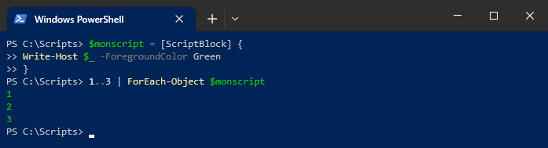
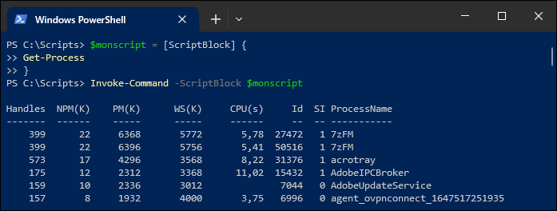

## Blocs de script (ScriptBlock)

Un script est un ensemble de plusieurs lignes de commande. Un fichier .PS1 est un script, mais on peut également définir un script dans une structure nommée *ScriptBlock*.

Un *ScriptBlock* est un objet de type `[ScriptBlock]` dans lequel on déclare une ou plusieurs lignes de commandes entre accolades `{ }`. Il sert à contenir du code PowerShell à exécuter. Vous en avez utilisé entre autres dans les commandes `Where-Object` et `ForEach-Object`.

On peut exécuter un bloc de script (par exemple, défini dans une variable) à l'aide de la commande `Invoke-Command`.

