import Tabs from '@theme/Tabs';
import TabItem from '@theme/TabItem';

# Rencontre 5 - Scripts PowerShell

:::note Résumé de la séance

<Tabs>

<TabItem value="deroulement" label="👨‍🏫 Déroulement du cours">

1. Rappel du cours précédent
1. Fichiers de script PowerShell
1. Configuration requise pour exécuter des scripts
1. Visual Studio Code
1. Bonnes pratiques

</TabItem>

<TabItem value="exercices" label="💻 Exercices à compléter">

- Exercice 04 sur OneNote
- N'oubliez pas le devoir #1 à remettre au plus tard dimanche le 10 septembre à 23h59.

</TabItem>

<TabItem value="ressources" label="📚 Ressources à consulter">

La présentation PowerPoint est sur le Teams du cours, sous le canal Général > Fichiers > Supports de cours.

</TabItem>

</Tabs>

:::


## Fichiers de script

Comme la plupart des langages de script, PowerShell est un langage interprété. Un fichier de script est donc un fichier texte standard contenant des lignes de commandes PowerShell. Lorsqu'on le passe dans l'interpréteur PowerShell, celui-ci exécute son contenu comme si chaque ligne du fichier était saisie une après l'autre dans la console. L'interpréteur reconnait le format d'un script PowerShell grâce à l'extension de fichier `.PS1`.


## Conditions d'exécution de scripts

Plusieurs conditions doivent être respectées afin d'exécuter un script PowerShell avec succès, que ce soit pour des raisons de sécurité ou de compatibilité.


### Stratégie d'exécution (*ExecutionPolicy*)

Par défaut, sous Windows 10/11, l'exécution de scripts PowerShell est interdite pour des raisons de sécurité. Seuls les scripts qui possèdent une signature numérique *AuthentiCode* sont autorisés. Les systèmes d'exploitation Windows Server, quant à eux, ne bloquent l'exécution de scripts que lorsqu'ils proviennent d'Internet. Dans tous les cas, il est possible de modifier ce comportement. Ces règles sont définies dans la **stratégie d'exécution** (*execution policy*).

Il existe plusieurs niveaux de stratégies d'exécution, et chacun détermine dans quelles condition le système d'exploitation peut refuser ou permettre l'exécution d'un script PowerShell. 

| Stratégie d'exécution | Caractéristiques |
| -- | -- |
| `Restricted` | Lorsque la stratégie d'exécution est Restricted, seuls les scripts portant une signature numérique (authenticode) sont approuvés et peuvent être exécutés par l'interpréteur PowerShell. C'est la stratégie par défaut sur les clients Windows. |
| `RemoteSigned` | Les scripts provenant d'un médium de stockage local, de l'intranet ou d'un site Internet de confiance sont autorisés. Ceux provenant d'Internet seront bloqués à moins de porter une signature numérique ou d'être débloqués avec la commande Unblock-File. C'est la stratégie par défaut sur les serveurs Windows, et la stratégie recommandée sur les clients Windows faisant partie d'un domaine ou utilisés pour développer des scripts. |
| `AllSigned` | Cette stratégie oblige tous les scripts à posséder une signature numérique. |
| `Unrestricted` | Les scripts non signés provenant d'Internet peuvent être exécutés, mais en demandant la permission à l'utilisateur. |
| `Bypass` | Cette stratégie est la plus permissive: tous les scripts peuvent s'exécuter sans restriction. |

Pour connaître la stratégie en vigueur, on peut lancer la commande `Get-ExecutionPolicy`.


Pour définir la stratégie, c'est la commande `Set-ExecutionPolicy` qu'il faut utiliser. 


Normalement, il faut être administrateur de sa machine pour pouvoir définir la stratégie d'exécution (la commande doit être lancée avec des privilèges **élevés**). Mais il est possible de la définir dans le contexte de l'utilisateur local avec l'argument `-Scope CurrentUser`.


Lorsque plusieurs stratégies sont définies, Windows utilise un ordre de priorité (appelé precedence) pour déterminer la valeur résultante. On peut voir la liste des stratégies d'exécution selon leur niveau de priorité en lançant la commande Get-ExecutionPolicy -List; la valeur effective est celle qui est retournée par Get-ExecutionPolicy sans spécifier d'argument.


Les niveaux de priorité (ou Scope) sont les suivants:

| Scope | Description |
| -- | -- |
| `MachinePolicy` | Configuration de la stratégie au moyen de GPO machine, dans Active Directory. Les GPO machine ont une priorité absolue. |
| `UserPolicy` | Configuration de la stratégie au moyen de GPO utilisateur, dans Active Directory. |
| `Process` | Configuration de la stratégie effective pour le processus seulement. On définit cette stratégie lors de l'appel du programme powershell.exe |
| `CurrentUser` | Configuration de la stratégie par défaut pour l'utilisateur courant. Cette stratégie peut être modifiée sans disposer de droits d'administration. |
| `LocalMachine` | Configuration de la stratégie par défaut pour l'ordinateur local. Cette stratégie peut être modifiée seulement par un administrateur de la machine. C'est le niveau le moins prioritaire. |

Lorsque l'un ou l'autre des scopes est non défini (undefined), cela signifie que ce niveau est ignoré. La stratégie effective sera la plus haute dans la liste de priorité parmi toutes celles qui ne sont pas "undefined".

:::tip

Lorsqu'on démarre une session PowerShell à l'aide du programme powershell.exe, on peut spécifier une ExecutionPolicy différente de la configuration du système, qui ne vaut que pour cette instance précise de PowerShell. Pour ce faire, on doit indiquer la stratégie voulue à l'aide du paramètre -ExecutionPolicy. Cela aura pour effet de définir le scope Process, dont la priorité dépasse celle des préférences machine et utilisateur. Seules les GPO ont une priorité supérieure.

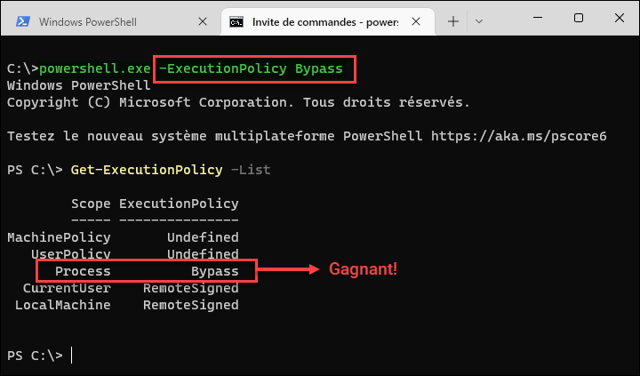

:::


### Fichiers bloqués

Lorsqu'on télécharge un fichier sur Internet, Windows appose automatiquement une marque sur le fichier. Cette marque, appelée Zone Identifier, est conservée dans un champ alternatif (Alternate Data Stream), une structure dans le système de fichiers NTFS permettant de stocker des métadonnées. Si vous téléchargez un fichier script sur Internet et que vous le savez sécuritaire (par exemple, votre script que vous téléchargez sur OneDrive), vous pouvez le débloquer par l'interface graphique dans ses propriétés, ou encore à l'aide de la commande `Unblock-File`.

Un fichier ainsi bloqué sera impossible à exécuter si la stratégie d'exécution est AllSigned ou RemoteSigned, à moins d'avoir été dûment signé au moyen d'un certificat Authenticode en règle.

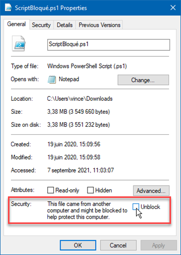

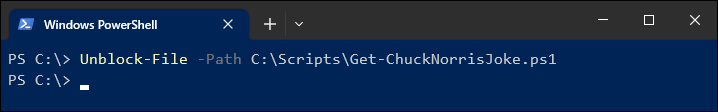


### Encodage

PowerShell 5.1 est assez capricieux sur l'encodage des caractères, surtout lorsqu'il est question de caractères accentués. Assurez-vous de sauvegarder les fichiers en format UTF8 avec BOM.

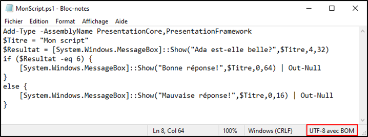

Si l'encodage n'est pas adéquat, vous pourrez vous retrouver avec des caractères bizarres au lieu des lettres accentuées.

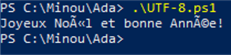


## Exécution de scripts

Une fois toutes les conditions respectées, il existe plusieurs manières d'exécuter un script PowerShell 5.1 sous Windows.


### Par l'interface graphique de Windows

Vous pouvez lancer un script directement à partir de l'explorateur de fichiers sous Windows. Vous pourriez être tenté de double-cliquer sur le fichier de script, mais vous ne feriez qu'ouvrir le fichier dans le bloc-notes. Il faut plutôt cliquer avec le bouton de droite dans l'explorateur, puis sélectionner Exécuter avec PowerShell.

Cette méthode est certes intuitives, mais présente quelques inconvénients:
- Vous ne pouvez pas démarrer le script en tant qu'administrateur.
- La fenêtre se ferme toute seule une fois le script terminé, ce qui ne vous laisse pas le temps de voir s'il y a eu une erreur lors de l'exécution.
- Il est impossible de spécifier des arguments à la ligne de commande.

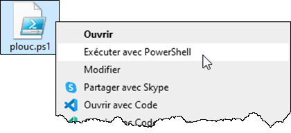


### Par la console PowerShell

C'est la méthode la plus utile, car elle permet de spécifier des arguments et de voir le résultat du script à la console.

Il suffit de démarrer une console PowerShell (en lançant le programme powershell.exe, par le menu démarrer, par le menu Win+X, etc.) puis exécuter un fichier .ps1. Si le chemin du fichier est relatif, vous devez démarrer le chemin par `.\` (comme sous Linux).

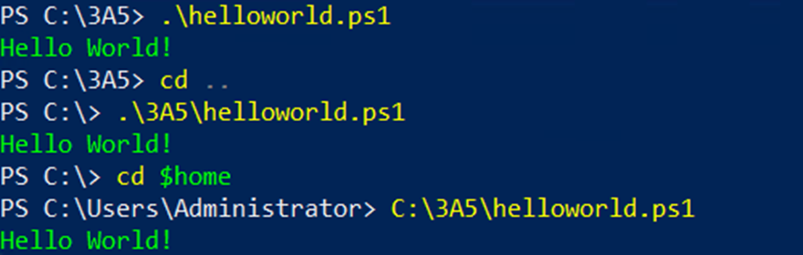

Si le script ne peut s'exécuter, lisez le message d'erreur. S'il est mention de la stratégie d'exécution (*ExecutionPolicy*), assurez-vous que votre stratégie soit définie à RemoteSigned ou plus permissif, et que votre fichier n'est pas bloqué (`Unblock-File`).


### À partir d'une commande classique

On peut lancer un script PowerShell à partir d'une commande classique, en lançant le programme `powershell.exe` avec l'argument `-file`.

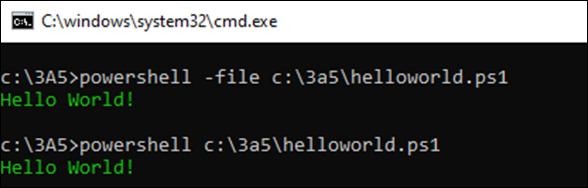

Il est aussi possible de contourner la stratégie d'exécution, en spécifiant l'argument `-ExecutionPolicy`.


## Le caractère *BackTick*

Voici quelques caractères spéciaux qui doivent être spécifiés à l'aide du caractère d'échappement, le *backtick*, qui ressemble à un accent grave sans la lettre qui l'accompagne.

| Caractère | Hex. | Déc. | Description |
| -- | -- | -- | -- |
| \`r | 0x0D | 13 | Retour de chariot (carriage-return) |
| \`n | 0x0A | 10 | Saut de ligne (line-feed) - changement de ligne sur les systèmes UNIX
| \`r\`n | 0x0D, 0x0A | 13, 10 | CRLF (retour de chariot + saut de ligne) - changement de ligne sur Windows |
| \`t | 0x09 | 9 | Caractère de tabulation |
| \`f | 0x0C | 12 | Caractère de saut de page (pour les imprimantes) |


Le caractère *Backtick* agit également de caractère d'échappement, c'est-à-dire que tout caractère qui le suit dans une chaîne de caractères est interprété comme un caractère normal, sans égard à son utilité normale.

| Caractère | Hex. | Déc. | Description |
| -- | -- | -- | -- |
| \`\` | 0x60 | 96 | Le caractère *backtick* (accent grave) |
| \`" | 0x22 | 34 | Le guillemet double |
| \`' | 0x27 | 39 | Le guillemet simple |
| \`# | 0x23 | 35 | Le carré (pour marquer les commentaires) |
| \`$ | 0x24 | 36 | Le signe de piastre (pour marquer les variables) |

Finalement, le caractère *Backtick* peut aussi être utilisé pour couper une ligne en deux.

```powershell
Copy-Item -Path "C:\Minou\miaou.txt" `
          -Destination "C:\Pitou\wouf.txt" `
          -Force
```


:::tip

Ce caractère est difficile à trouver sur certains clavier, dont celui qui est le plus commun au Québec. Sur ce clavier (celui où on presse sur la touche de l'accent grave puis sur celle de la lettre), il suffit de faire un "espace accent grave".


:::


## Environnements de développement

Les scripts PowerShell sont des fichiers texte, il est donc parfaitement possible de les développer à l'aide de n'importe quel éditeur de texte (le bloc-notes, Notepad++, Nano, etc.)

Il existe cependant des éditeurs qui sont faits spécialement pour développer en PowerShell. En voici quelques une:
- [Windows PowerShell ISE](https://learn.microsoft.com/fr-ca/powershell/scripting/windows-powershell/ise/introducing-the-windows-powershell-ise?view=powershell-5.1) (inclus dans Windows)
- [Microsoft Visual Studio Code](https://code.visualstudio.com/) (gratuit et *open-source*)
- [Idera PowerShell Plus](https://www.idera.com/productssolutions/freetools/powershellplus/)
- [SAPIEN PowerShell Studio](https://www.sapien.com/software/powershell_studio) ($$$)


## Visual Studio Code

Visual Studio Code est un environnement intégré de développement (IDE) offert gratuitement par Microsoft. Il possède de nombreuses fonctionnalités pour aider les programmeurs à écrire, gérer et tester leur code. Il supporte de nombreux langages de programmation, dont PowerShell. C'est cet outil de développement que vous utiliserez tout au long de ce cours.

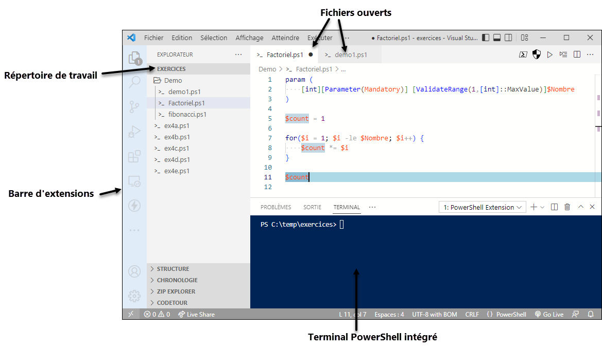


### Espace de travail

Il est idéal de travailler dans VS Code en y ouvrant un dossier. Vous pouvez le faire soit en cliquant sur Ouvrir le dossier dans l'interface de VS Code, soit 

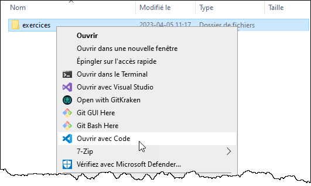

Dans le panneau de gauche, vous pouvez voir tous vos fichiers et dossiers et les ouvrir dans les onglets. Vous pouvez-même ouvrir plusieurs fichiers côte à côte.

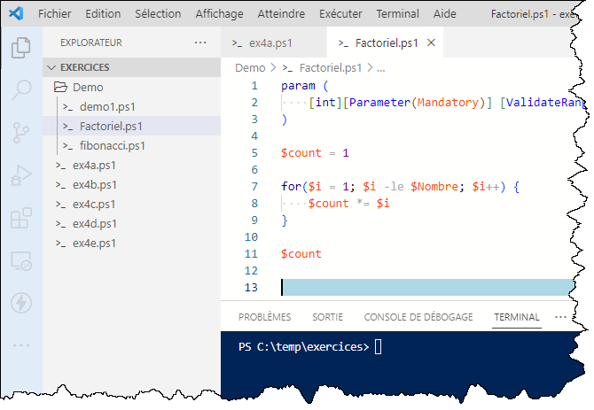


### Palette de commandes

Vous pouvez ouvrir la palette de commandes en appuyant sur la touche F1 ou Ctrl+Maj+P. Vous pouvez rechercher des fonctionnalités et des actions.


### Terminal intégré et exécution PowerShell

Lorsque vous avez un fichier .PS1 ouvert, le terminal intégré PowerShell démarre automatiquement.

Vous pouvez utiliser ce terminal de la même manière qu'une invite PowerShell standard.

Si vous sélectionnez une partie de votre code et appuyez sur la touche F8, ce code sera automatiquement passé dans le terminal.


Pour lancer le script facilement, appuyez simplement sur F5. Cela exécute le script dans le terminal intégré en mode débogage.

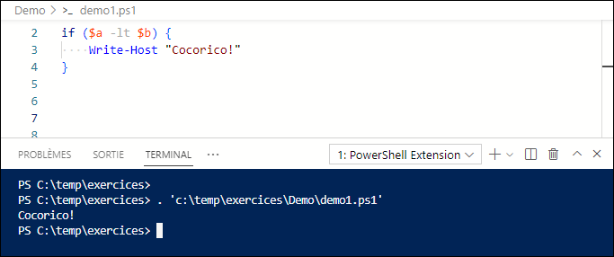


Pour automatiquement sélectionner toutes les occurrences d'un même mot (par exemple, pour changer le nom d'une variable partout à la fois), sélectionner le texte à remplacer puis faites Ctrl+F2 (ou clic droit, Modifier toutes les occurrences).

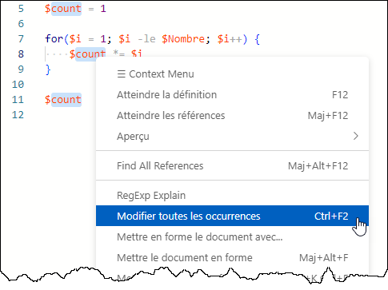


### Installation

Dans les laboratoires du Collège, VS Code est déjà installé et configuré pour le développement de scripts en PowerShell. Si vous souhaitez l'utiliser sur votre ordinateur personnel ou sur une machine virtuelle, suivez ces directives.

Téléchargez l'application sur le site officiel (https://code.visualstudio.com/). Il en existe plusieurs variantes:
- Stable build: c'est la version la plus stable, et celle que vous devriez utiliser.
- Insider build: c'est une préversion pour tester les nouvelles fonctionnalités. Il peut y avoir des bogues.

Choisissez l'installateur qui convient à vos besoin.

- User Installer: c'est l'option par défaut. VS Code s'installe dans votre profil utilisateur, donc vous n'avez pas besoin de droits d'administration. Il sera installé seulement pour vous, pas pour les autres utilisateurs.
- System Installer: pour installer VS Code pour tous les utilisateurs du système. Ça prend des droits d'administration.

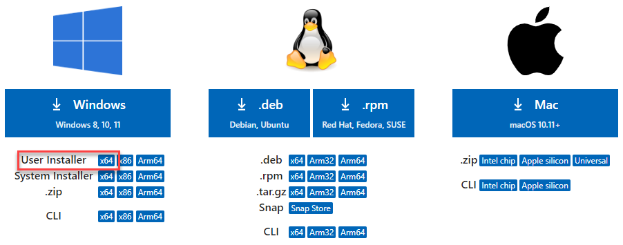

Puis, lancez l'installateur et répondez aux questions. Assurez-vous de déposer une icône sur le bureau et d'enregistrer les actions au menu contextuel.


### Configuration

Installez mon pack d'extensions. Cela installera tout ce qu'il vous faut pour développer en PowerShell!


Une fois terminé, vous devez redémarrer VS Code. Vous constaterez qu'il est maintenant en français.

Je vous recommande d'activer le thème de couleur "PowerShell ISE", car il est optimisé pour PowerShell. Mais s'il ne vous plait pas, vous pouvez en essayer d'autres, et même en installer de nouveaux.


Ajustez les paramètres de VS Code. Vous pouvez explorer les paramètres disponibles, mais voici minimalement ceux que je vous recommande:

Copiez-collez ceci dans le fichier settings.json, et sauvegardez-le.

```json
{
    "powershell.codeFormatting.preset": "Stroustrup",
    "powershell.codeFormatting.trimWhitespaceAroundPipe": true,
    "powershell.codeFormatting.useCorrectCasing": true,
    "powershell.integratedConsole.focusConsoleOnExecute": false,

    "[powershell]": {
        "files.encoding": "utf8bom",
        "editor.suggestSelection": "first",
        "editor.tabCompletion": "on",
        "editor.codeLens": false
    },

    "workbench.colorTheme": "PowerShell ISE"   
}
```


## Les structures de contrôle

A priori, les instructions contenues dans un fichier de script dont exécutées dans un ordre séquentiel, que l'on appelle le **flot de contrôle** (*control flow*). Les structures de contrôle sont des instructions qui permettent de dévier le flot de contrôle et ainsi rendre le programme dynamique.

Il existe quatre grands types de structures de contrôle:
- La **sélection**, qui permet d'ignorer des instructions sous certaines conditions;
- La **répétition**, qui permet de revenir en arrière et répéter une instruction ou un ensemble d'instructions plusieurs fois en boucle;
- Le **sous-programme**, qui permet d'interrompre le cours normal du programme et d'exécuter du code déclaré ailleurs;
- Le **déplacement**, qui permet de se "déplacer" ailleurs dans le code. Ce type de structure de contrôle est jugée désuète dans de nombreux langages de programmation, y compris PowerShell.


### Les structures de sélection

#### Sélection à une branche (*If*)

La structure `If` permet une sélection de code conditionnelle. Dans sa variante à une branche, on pose une condition booléenne; si la condition est vraie, le code spécifié entre accolades sera exécuté, autrement il sera ignoré.

<Tabs>
<TabItem value="code" label="Code">

```powershell
[int] $nombre = Read-Host "Entrez un nombre de 1 à 3..."

if ($nombre -eq 1) {
    Write-Host "Un!"
}

Write-Host "Fini!"

```

</TabItem>
<TabItem value="resultat" label="Résultat">

<PowerShellWindow workdir="C:\Scripts" command=".\If.ps1" result="
Entrez un nombre de 1 à 3...: 1
Un!
Fini!" />

</TabItem>
</Tabs>


#### Sélection à deux branches (*If...Else*)

Dans sa variable à deux branche, on déclare un deuxième bloc de code à l'aide de l'instruction `else`. C'est le code qui sera exécuté uniquement si la condition est évaluée `false`.


<Tabs>
<TabItem value="code" label="Code">

```powershell
[int] $nombre = Read-Host "Entrez un nombre de 1 à 3..."

if ($nombre -eq 1) {
    Write-Host "Un!"
}
else {
    Write-Host "Autre!"
}

Write-Host "Fini!"
```

</TabItem>
<TabItem value="resultat" label="Résultat">

<PowerShellWindow workdir="C:\Scripts" command=".\IfElse.ps1" result="
Entrez un nombre de 1 à 3...: 2
Autre!
Fini!" />

</TabItem>
</Tabs>


#### Sélection imbriquée (*If...ElseIf...Else*)

On peut imbriquer autant de blocs `ElseIf` que l'on veut entre le `If` et le `Else`. Chaque bloc `ElseIf` pose une condition. Si la condition spécifiée dans le bloc `If` ou dans le bloc `ElseIf` précédent est fausse, alors le bloc suivant tente son exécution. En dernier recours, le bloc `Else` est exécuté uniquement lorsque toutes les conditions des blocs `If` et `ElseIf` n'ont pas été respectées. Il est important de noter que dès qu'une condition est vraie, les blocs `ElseIf` suivants ne seront pas exécutés, même si leur condition est vraie; seulement le premier à évaluer vrai sera exécuté.

<Tabs>
<TabItem value="code" label="Code">

```powershell
[int] $nombre = Read-Host "Entrez un nombre de 1 à 3..."

if ($nombre -eq 1) {
    Write-Host "Un!"
}
elseif ($nombre -eq 2) {
    Write-Host "Deux!"
}
else { 
    Write-Host "Autre!" 
}

Write-Host "Fini!"
```

</TabItem>
<TabItem value="resultat" label="Résultat">

<PowerShellWindow workdir="C:\Scripts" command=".\IfElseifElse.ps1" result="
Entrez un nombre de 1 à 3...: 2
Deux!
Fini!" />

</TabItem>
</Tabs>


#### Sélection à *n* branches (*switch*)

L'instruction `Switch` est une alternative à `If`. Elle est pratique lorsqu'on a de nombreuses valeur à tester et que la condition est simple, comme les options d'un menu par exemple.

Optionnellement, on peut spécifier un cas Default, qui est sélectionné si aucun autre cas n'est évalué vrai.

<Tabs>
<TabItem value="code" label="Code">

```powershell
[int] $nombre = Read-Host "Entrez un nombre de 1 à 3..."

switch ($nombre) {
    1   { Write-Host "Un!"      }
    2   { Write-Host "Deux!"    }
    3   { Write-Host "Trois!"   }
    Default { 
        Write-Host "Autre!" 
    }
}

Write-Host "Fini!"
```

</TabItem>
<TabItem value="resultat" label="Résultat">

<PowerShellWindow workdir="C:\Scripts" command=".\Switch.ps1" result="
Entrez un nombre de 1 à 3...: 2
Deux!
Fini!" />

</TabItem>
</Tabs>


#### Exemples de sélection

##### Tester l'existence d'un répertoire

```powershell
if (Test-Path -Path "C:\Minou" -PathType Container) {
    Write-Host "Le répertoire existe!"
}
else {
    Write-Host "Le répertoire n'existe pas!"
}
```

##### Tester si une collection est vide

```powershell
$chemin = Read-Host -Prompt "Entrez un chemin de répertoire"

$documents = Get-ChildItem -Path $chemin | Where-Object { $_.Name -like "*.docx" }

if ($documents.count -gt 0) {
    Write-Host "Il y a $($documents.count) documents."
}
else {
    Write-Host "Il n'y a aucun document."
}
```


##### Tester si un objet est nul (cas particulier)

```powershell
$service = Get-Service "Nexistepas"

if ($null -ne $service) {
    Write-Host "Le service est: $($service.status)."
}
else {
    Write-Host "Service introuvable."
}
```


### Structures de répétition (boucles)

#### Boucle *tant que* (*While*)

Dans une boucle *While*, le code entre accolade est exécuté si la condition est vraie. Le code est réexécuté encore et encore tant que l’évaluation de la condition soit toujours vraie. Lorsque la condition devient fausse, la boucle est interrompue et le code continue son exécution normale.

<Tabs>
<TabItem value="code" label="Code">

```powershell
$i = 0

while ($i -le 3) {
    Write-Host $i
    $i++
}

Write-Host "Fini!"
```

</TabItem>
<TabItem value="resultat" label="Résultat">

<PowerShellWindow workdir="C:\Scripts" command=".\While.ps1" result="
0
1
2
3
Fini!" />

</TabItem>
</Tabs>


#### Boucle *jusqu'à ce que* (*Do ... While*)

Dans une boucle *Do ... While*, le code entre accolades après l’instruction do est exécuté.
À la fin du bloc de code, si la condition est respectée, ce code est réexécuté.
Lorsque la condition devient fausse, la boucle est interrompue et le code continue son exécution normale.

<Tabs>
<TabItem value="code" label="Code">

```powershell
$i = 0

do {
    Write-Host $i
    $i++
}
while ($i -le 3)

Write-Host "Fini!"
```

</TabItem>
<TabItem value="resultat" label="Résultat">

<PowerShellWindow workdir="C:\Scripts" command=".\DoWhile.ps1" result="
0
1
2
3
Fini!" />

</TabItem>
</Tabs>

:::warn

La différence entre les boucles *While* et *Do...While* est subtile mais importante. Dans le cas de la boucle *While*, la condition est évaluée **avant** le premier tour de boucle. Donc il est possible que le code de la boucle ne soit exécuté aucune fois. À l'inverse, la condition de la boucle *Do...While* est évaluée après le premier tour; on a donc la certitude que le code de la boucle sera exécuté au moins une fois, même si la condition initiale ne le permettrait pas. Choisissez donc le type de boucle qui répond le mieux à votre besoin.

:::


#### Boucle infinie

Une boucle infinie survient lorsque la condition de bouclage est toujours vraie. En temps normal, on cherche à éviter ce scénario, sauf dans des cas très spécifiques. 

Il faut toujours prévoir une façon de sortir de la boucle. On peut sortir de la boucle avec l’instruction `break`.

<Tabs>
<TabItem value="code" label="Code">

```powershell
$i = 0
while ($true) {
    Write-Host $i

    if ($i -gt 3) {
        break
    }
    $i++
}

Write-Host "Fini!"
```

</TabItem>
<TabItem value="resultat" label="Résultat">

<PowerShellWindow workdir="C:\Scripts" command=".\WhileTrue.ps1" result="
0
1
2
3
Fini!" />

</TabItem>
</Tabs>


#### Boucle compteur (*For*)

Une boucle compteur est utile lorsqu’on souhaite répéter le code un certain nombre de fois. 

La syntaxe comprend trois parties:
- L’action à exécuter au début de la boucle (une seule fois)
- La condition de bouclage (si elle est vraie, on entre dans la boucle)
- L’action à exécuter après chaque tour de boucle

La boucle *for* utilise typiquement une variable contenant un nombre entier comme compteur, bien que ce type de boucle puisse être utilisé de manière différente. 


<Tabs>
<TabItem value="code" label="Code">

```powershell
for ($i = 0; $i -le 3; $i++) {
    for ($j = 0; $j -le 2; $j++) {
        Write-Host "$i.$j"
    }
}
Write-Host "Fini!"
```

</TabItem>
<TabItem value="resultat" label="Résultat">

<PowerShellWindow workdir="C:\Scripts" command=".\For.ps1" result="
0.0
0.1
0.2
1.0
1.1
1.2
2.0
2.1
2.2
3.0
3.1
3.2
Fini!" />

</TabItem>
</Tabs>

:::tip

Les variables compteur sont typiquement nommées `$i`. Normalement, les variables devraient avoir un nom plus significatif, mais par convention il est acceptable de nommer les compteurs avec une simple lettre.

Si deux boucles ou plus sont imbriquées les unes dans les autres, on peut utiliser les variables `$j`, `$k`, et ainsi de suite.

:::


#### Boucle de collection (*ForEach*)

Une boucle de collection est utile lorsqu’on a du code à exécuter pour chaque élément d’une collection.

La syntaxe comprend deux parties:
- L’objet courant, **une variable** qui représente un élément. Il sera différent à chaque tour de boucle.
- La **collection**, qui sera traitée un élément à la fois, à chaque tour de boucle.

<Tabs>
<TabItem value="code" label="Code">

```powershell
$collection = 0..3

foreach ($element in $collection) {
    Write-Host $element
}

Write-Host "Fini!"
```

</TabItem>
<TabItem value="resultat" label="Résultat">

<PowerShellWindow workdir="C:\Scripts" command=".\ForEach.ps1" result="
0
1
2
3
Fini!" />
</TabItem>
</Tabs>


#### Boucle de pipeline (*ForEach-Object*)

Au lieu de la boucle ForEach, on peut utiliser le cmdlet `ForEach-Object`. L’effet est le même, mais fait usage du pipeline PowerShell. 

L’objet courant est représenté par la variable pipeline `$_` (ou alternativement, `$PSItem`).

<Tabs>
<TabItem value="code" label="Code">

```powershell
$collection = 0..3

$collection | ForEach-Object {
    Write-Host $_
}

Write-Host "Fini!"
```

</TabItem>
<TabItem value="resultat" label="Résultat">

<PowerShellWindow workdir="C:\Scripts" command=".\ForEach-Object.ps1" result="
0
1
2
3
Fini!" />
</TabItem>
</Tabs>


### Échappement (*break*)

Pour quitter "de force" une structure de contrôle, on peut utiliser l'instruction `break`.

```powershell
While ($true) {

    $reponse = Read-Host -Prompt "Voulez-vous quitter? (O/N)"

    if ($reponse -eq "O") {
        Write-Host "kbye"
        break
    } 

    Write-Host "Attendons un peu..."
    Start-Sleep -Seconds 2

}
```

:::tip

À tout moment durant l'exécution d'un script, lorsqu'on est prisonnier d'une boucle infini, on peut appuyer sur `CTRL+C` dans la console pour mettre fin à l'exécution du script instantanément.

:::


## Bonnes pratiques de scriptage

Certaines bonnes pratiques sont d'usage lorsqu'on développe un script en PowerShell.

### Alias et noms de paramètres

Dans un script, on cherche la lisibilité avant tout. On doit donc autant que possible **éviter d'utiliser les alias** et leur préférer les vrais noms des commandes (sous leur forme Verbe-Nom).

On doit aussi éviter les paramètres positionnels. On peut les utiliser dans certaines commandes où leur utilisation est évidente, comme `Write-Host`, `Where-Object` ou `ForEach-Object`, mais règle générale, on préfère voir le nom des paramètres.

```powershell
❌ dir C:\Windows

✅ Get-ChildItem -Path "C:\Windows"
```

### Commentaires

Il est important de bien documenter son code au moyen de commentaires pertinents. Un commentaire est du texte compris à l'intérieur du fichier mais qui est ignoré pendant l'exécution du script. La plupart des éditeurs de scripts afficheront les commentaires d'une couleur distinctive, généralement en vert.

En PowerShell, le caractère qui désigne les commentaires est le carré ou *hash* (`#`). Dès qu'un `#` est rencontré sur une ligne, tous les caractères jusqu'à la fin de la ligne sont ignorés. Si la ligne commence par un `#`, c'est la ligne au complet qui est ignorée.

Il est aussi possible de définir un bloc de commentaires sur plusieurs lignes. Dans ce cas, le bloc commence par `<#` et finit par `#>`.

```powershell
<#
    Ceci est un exemple. 
    Voici un bloc de commentaires.
#>

$Path = "C:\Minou" # le répertoire

If (-not (Test-Path -Path $Path)) {
    # Le répertoire n'existe pas, alors on le créée
    New-Item -Path "C:\Minou" -ItemType Directory
}
```

:::caution

N'en faites pas trop! Un commentaire est utile mais un code clair et lisible est mieux. C'est pour cela qu'on préfère utiliser les vrais noms des commandes et des paramètres; les commandes parlent d'elles-mêmes. Les commentaires devraient être utilisés lorsque la logique est complexe ou pour donner du contexte, pour expliquer **pourquoi** une commande est utilisé à cet endroit dans le script plutôt que ce qu'elle fait.

:::


### Indentation

L'indentation est importante en programmation, car elle permet de voir visuellement dans quel bloc se situe le code. C'est particulièrement utile dans une structure de contrôle, comme une condition ou une boucle.

Par convention, un niveau d'indentation est équivalent à quatre espaces. C'est cette taille de tabulation que Visual Studio Code insère lorsqu'on presse la touche de tabulation.


:::danger

PowerShell n'impose pas l'indentation, contrairement à Python par exemple. Elle sert uniquement à la lisibilité. Toutefois, même si votre code PowerShell fonctionne sans indentation, vous risquez de perdre des points dans vos évaluation si votre code est mal indenté.

:::

Il y a également des préférences quant à si l'ouverture d'accolades se fait sur la même ligne ou sur la ligne suivante. Certains programmeurs préfèrent la première forme, d'autres la deuxième. Les deux sont valides, mais celle qui est configurée par défaut dans VS Code dans les laboratoires est celle du professeur, où les accolades commencent à la fin de la ligne.

:::tip

Visual Studio Code est capable d'ajuster automatiquement les indentations en fonction des ouvertures et fermetures de blocs. Vous n'avez qu'à lancer la fonctionnalité de mise en forme par le menu contextuel ou avec le raccourci clavier `Maj+Alt+F`.

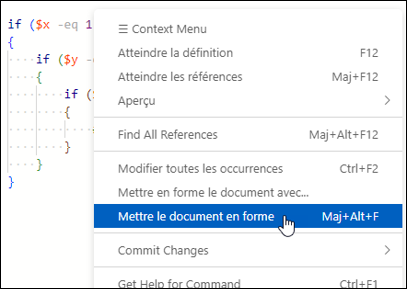

:::