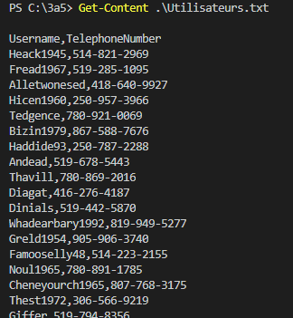
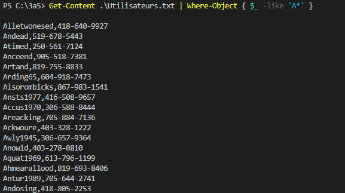
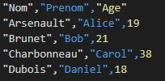
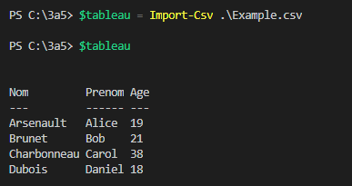
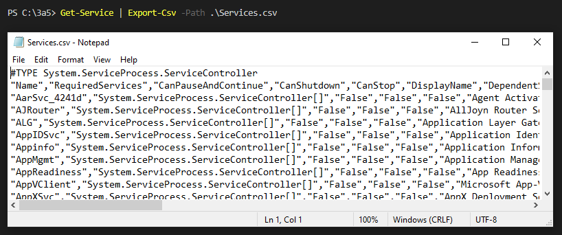
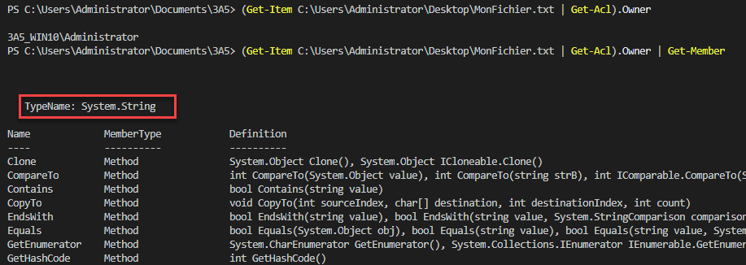

import Tabs from '@theme/Tabs';
import TabItem from '@theme/TabItem';

# Rencontre 7 - Fichiers, strings, regex

:::note Résumé de la séance

<Tabs>

<TabItem value="deroulement" label="👨‍🏫 Déroulement du cours">

1. Fichiers
1. Manipulation de chaînes de caractères
1. Expressions régulières

</TabItem>

<TabItem value="exercices" label="💻 Exercices à compléter">

- Exercice 06a - Fichiers CSV
- Exercice 06b - Logging
- Exercice 06c - Expressions régulières

</TabItem>

<TabItem value="ressources" label="📚 Ressources à consulter">

La présentation PowerPoint est sur le Teams du cours, sous le canal Général > Fichiers > Supports de cours.

</TabItem>

</Tabs>

:::


## Fichiers

Un **fichier** est une unité logique de stockage de données, contenue sur un **volume** (aussi appelé **disque logique**). Un volume, sous Windows, est généralement identifié par une lettre (C:, D:, etc.) et occupe une région plus ou moins grande sur un médium physique de stockage. Sur un disque dur, cette région se nomme une **partition**. Pour pouvoir stocker les fichiers, un volume doit être **formaté** dans un **système de fichiers**, qui détermine la structure des fichiers et des répertoires ainsi que des fonctionnalités connexes (sécurité, taille de blocs, résilience, métadonnées, etc.). Les systèmes de fichiers les plus répendus sous Windows sont *NTFS*, *FAT32*, *ExFAT* ou *ReFS*, alors que les plus répendus sous Linux sont *Ext4* et *ZFS*. 

Certains volumes sont stockés sur un système distant, et sont accessibles par le biais d'un protocole de partage de fichiers sur le réseau (par exemple, SMB sous Windows, NFS sous Linux). On les appelle les volumes réseaux, ou lecteurs réseaux (*network drive*), par opposition aux volumes locaux, ou lecteurs locaux (*local drives*), qui sont directement connectés à l'ordinateur.

Un système de fichiers possède typiquement une table d'allocation, une sorte de table des matières qui dispose chaque fichier dans l'arborescence et indique à quel endroit de la surface du médium les données comprises dans le fichier se trouvent physiquement. Ces données sont simplement une suite d'octets, et le format de fichier permet à un programme de lire le fichier et interpréter correctement ces octets. Sous Windows, l'extension du nom du fichier aide le système d'exploitation et les applications à savoir quel est le format du fichier et comment interpréter ses données.

Il existe deux grandes catégories de fichiers:
- Les fichiers **texte**, dont les octets encodent des caractères en utilisant une table de caractères standardisée telle que UTF-8 ou ANSI. C'est le cas des fichiers TXT, PS1, JSON, HTML, CSV, etc.

    

- Les fichiers **binaires**, qui contiennent des données numériques brutes. C'est le cas des fichiers ZIP, JPG, PNG, DOCX, XLSX, etc.

    

PowerShell offre plusieurs commandes pour traiter avec des fichiers de différents formats.


### Navigation dans le système de fichiers

Vous connaissez déjà la commande `Get-ChildItem`. C'est un peu l'équivalent de DIR dans l'invite de commandes classique. Cette commande, lorsqu'elle est lancée sur le système de fichiers, retourne le contenu d'un répertoire.

Nous avons déjà dit que `Get-ChildItem`, lorsqu'il retourne plusieurs objets, retourne un tableau d'objets. Comme les fichiers et les dossiers sont des structures différentes, et que ces deux types d'objets peuvent se retrouver dans un même tableau, le tableau est donc constitué de deux types d'objets:

- Chaque fichier est de type `System.IO.FileInfo`
- Chaque répertoire est de type `System.IO.DirectoryInfo`

On peut aussi utiliser la commande `Get-Item` pour obtenir l'objet qui représente un fichier ou un répertoire, contrairement à `Get-ChildItem` qui retourne plusieurs objets enfants.


### Fichiers texte

Il est très fréquent qu'un script doive lire dans un fichier. Un usage typique de lecture d'un fichier texte est pour traiter des entrées multiples.

Par exemple, votre employeur vient de faire l'acquisition d'une entreprise concurrente, et votre patron vous demande de créer des comptes utilisateurs pour chacun des 3000 employés visés par l'acquisition. La manière la plus simple de procéder est de faire un script qui lit un fichier contenant les informations de chacun des employés ligne par ligne.

La principale commande pour lire un fichier est `Get-Content`.



`Get-Content` lit le fichier ligne par ligne. Donc, cette commande retourne un tableau de string.


On peut facilement traiter le fichier dans une boucle.


Ou par un filtre.



Et on peut passer un fichier par le pipeline.


Et faire toutes les manipulations souhaitées.

```powershell
Get-Item -Path ".\Utilisateurs.txt" | Get-Content | Where-Object { $_ -like 'A*' } | ForEach-Object {
    $split = $_.Split(',')
    [PSCustomObject]@{
        Nom = $split[0]
        Tel = $split[1]
    }
} | Sort-Object | Format-Table
```

Pour écrire dans un fichier, vous pouvez utiliser plusieurs commandes.

La commande `Out-File` exporte un objet vers un fichier. Tout ce qui entre dans cette commande par le pipeline sera sortie vers un fichier, ce qui implique une conversion en texte. Si le fichier de destination n'existe pas, il sera automatiquement créé.

On peut activer le switch `-Append` si on veut que les objets soient ajoutés à la fin du fichier s'il existe déjà, sinon le contenu sera remplacé.


On peut aussi spécifier divers encodages.


Si le fichier n'existe pas, il sera créé automatiquement. Si on souhaite plutôt que le script plante si le fichier existe déjà, on peut activer le switch `-NoClobber`.

Alternativement, les commandes `Set-Content` et `Add-Content` écrivent du contenu dans un fichier texte. Si le fichier n'existe pas, il sera automatiquement créé. Son fonctionnement est très semblable à celui de `Out-File`, et dans la majorité des cas, on peut utiliser l'une ou l'autre des méthodes.

- La commande `Set-Content` **remplace** le contenu du fichier.
- La commande `Add-Content` **ajoute** le contenu à la fin du fichier.


### Fichiers CSV

Un fichier CSV (pour Comma Separated Values) est un fichier texte où chaque valeur est délimitée par une virgule (ou un point-virgule dans les régions où les décimales sont représentées par des virgules et non des points). 



C'est un format utilisé, entre autres, pour importer des données dans Excel. En effet, le contenu du fichier CSV peut facilement être vu comme un tableau composé de champs (colonnes) et de rangées. La première ligne désigne le titre des colonnes.

Pour lire un fichier CSV, on peut utiliser la commande `Import-CSV`. Permet de transformer le contenu d'un fichier CSV en tableau de PSCustomObject.



Pour écrire un fichier CSV à partir d'une structure de données (comme un tableau d'objets), on fait appel à `Export-Csv`.



Finalement, les commandes `ConvertTo-Csv` et `ConvertFrom-Csv` sont comme les commandes `Export-Csv` et `Import-Csv`, mais au lieu de travailler avec les fichiers CSV, elles travaillent avec des chaînes de caractères CSV. C'est pratique dans certains cas, si on veut envoyer les données CSV dans une base de données ou sur le réseau.


:::info Note
Par défaut, lorsque PowerShell produit du texte formaté en CSV, une ligne #TYPE s'ajoute automatiquement au début du fichier. Cette ligne n'est pas reconnus par plusieurs logiciels traitant avec des fichiers CSV, comme Excel. Pour l'enlever, il suffit d'activer le switch `-NoTypeInformation` lors de l'appel de `Export-Csv` ou `ConvertTo-Csv`.


:::

#### Délimiteur

Il faut faire attention au délimiteur. Souvent c'est la virgule, mais dans certaines régions, c'est autre chose. En français, comme la virgule est déjà utilisée comme séparateur décimale, par défaut c'est le point-virgule qui est utilisé. Ainsi, sur une machine configurée en français, lorsqu'on tente d'importer un CSV produit sur une machine en anglais, Excel n'arrive pas à séparer les colonnes. 

On peut connaître le caractère utilisé par Windows pour séparer les listes par l'interface graphique ou encore grâce à `Get-Culture`.


```powershell
(Get-Culture).TextInfo.ListSeparator
```

PowerShell prend toujours la virgule par défaut, peu importe la langue du système, contrairement à Excel qui prend le séparateur de liste défini dans les options régionales.

- Pour prendre le caractère de séparation défini dans les options régionales, il faut utiliser le switch `-UseCulture`.
- Pour spécifier le caractère de séparation, on peut le faire avec le paramètre `-Delimiter` et lui passer un caractère en argument.


### Fichiers JSON

PowerShell offre aussi des commandes qui permettent de convertir des objets en JSON et vice-versa. Il n'existe toutefois pas de commandes d'exportation et d'importation comme pour les CSV; il faut alors procéder en deux étapes.

Pour lire un fichier JSON et le convertir en une structure complexe de listes et de dictionnaires, on peut récupérer le texte brut du fichier avec `Get-Content`, puis passer le résultat par le pipeline dans la commande `ConvertFrom-Json`.

```powershell
$canadiens = Get-Content -Path ".\canadiens.json" | ConvertFrom-Json
```

Pour écrire une structure dans un fichier JSON, il suffit de passer l'objet par le pipeline dans `ConvertTo-Json` puis écrire le résultat dans un fichier à l'aide de `Set-Content` ou `Out-File`.

```powershell
$canadiens | ConvertTo-Json | Set-Content -Path ".\canadiens.json"
```

:::info Note
Lorsque vous tentez de convertir en JSON des objets complexes, vous pouvez préciser le niveau de profondeur de la conversion en JSON à l'aide du paramètre `-Depth`.
:::


### Journalisation

Il est généralement une bonne pratique de programmer nos scripts de telle sorte qu'ils documentent leur déroulement dans un fichier journal (ou log). Ainsi, lorsqu'on suspecte qu'un script a failli à sa tâche, on peut se référer au fichier log pour investiguer les causes de la défaillance.

#### Format

Un fichier log type est en format texte brut et porte l'extension .log. Chaque fois que le script rencontre une action importante au cours de son exécution, il ajoute une ligne à la fin du fichier pour documenter cette action. Chaque ligne est horodatée avec précision afin de déceler d'éventuelles lenteurs dans l'exécution d'une action.

:::info Note
Certains logs adoptent un format particulier, qui correspondent à un outil qui en facilite la lecture. Par exemple, SCCM produit ses logs dans un format difficilement lisible avec un éditeur de texte, mais parfaitement adaptés à l'outil CMtrace, qui vient avec. 
:::

#### Niveau de détail

Les logs peuvent être très détaillés ou très sommaires, dépendant du besoin et de la criticité du service impacté. Il est même possible de permettre différents niveaux de verbosité, au besoin. 

#### Emplacement du fichier log

Il est important de sauvegarder le fichier log à un endroit judicieux. Il n'est habituellement pas recommandé de le sauvegarder dans le répertoire de travail, puisque celui-ci tend à être imprévisible. De plus, il n'est pas toujours approprié de choisir le répertoire sur lequel le script est exécuté, puisque rien ne garantit que l'utilisateur possède des droits d'écriture à cet emplacement, particulièrement si le script n'a pas besoin de privilèges d'administration.

Généralement, on choisit un emplacement où l'on sait que l'utilisateur possède des droits d'écriture. On privilégie donc les emplacements à l'intérieur du profil de l'utilisateur, comme ceux représentés par les variables d'environnement `LOCALAPPDATA`, `APPDATA` ou `TMP`.

Il n'est pas rare que l'emplacement du fichier journal puisse être définie par un paramètre.

#### Activation du log

Plusieurs scripts utilisent un paramètre pour activer la journalisation. Il peut s'agir d'un paramètre de type Switch, ou encore simplement d'un paramètre qui permet de spécifier le nom du fichier log (s'il n'est pas spécifié, la journalisation est désactivée).

#### Rotation

La taille des fichiers log est un problème commun. En effet, les fichiers log peuvent prendre une taille considérable avec le temps. Il est donc important de prendre ce fait en considération, particulièrement si le script est très verbeux.

La stratégie classique consiste à définir une taille maximale au fichier log (par exemple, 10 Mo). Dès que cette taille sera atteinte, le fichier est renommé différemment (par exemple, `journal.log` est renommé en `journal.lo_`). Et si le fichier `journal.lo_` existe déjà, il est détruit pour laisser la place au nouveau `journal.lo_`.


### Fichiers Zip

PowerShell offre la possibilité de compresser ou décompresser des fichiers. Les commandes sont `Compress-Archive` et `Expand-Archive`.

Cependant, ces commandes souffrent d'une très mauvaise performance. On peut améliorer nettement la performance en faisant appel aux méthodes de *.NET Framework*.

```powershell
# Déclarer la classe .NET offrant les méthodes de compression
Add-Type -Assembly "System.IO.Compression.Filesystem"

# Pour compresser
[System.IO.Compression.ZipFile]::CreateFromDirectory("C:\vers\RepertoireSource","C:\vers\destination.zip")

# Pour décompresser
[System.IO.Compression.ZipFile]::ExtractToDirectory("C:\vers\source.zip", "C:\vers\RepertoireDestination") }
```


### Sécurité

On peut utiliser PowerShell pour consulter et modifier les listes d'accès aux fichiers.


Il existe plusieurs manière d'obtenir les listes d'accès avec PowerShell.

Les objets de type `FileInfo` et `DirectoryInfo` possèdent une méthode `GetAccessControl()`, qui retourne un objet de type `System.Security.AccessControl.FileSecurity` (ou `System.Security.AccessControl.DirectorySecurity`, pour les répertoires). 


Cet objet contient l'information de sécurité de ce fichier ou dossier.

On peut aussi obtenir ce même objet avec la commande `Get-Acl`.

```powershell
Get-Item -Path "C:\Users\Administrator\Desktop\MonFichier.txt" | Get-Acl
  # ou
Get-Acl -Path "C:\Users\Administrator\Desktop\MonFichier.txt"
```

Dans tous les cas, l'objet retourné est le même.

On peut obtenir les propriétés que l'on peut interroger sur l'objet de type FileSecurity. 


Vous pouvez, par exemple, obtenir les accès au fichier ou au dossier avec la propriété Access.


Vous pouvez aussi obtenir l'information sur le propriétaire, et ce, de deux manières différentes.

Par la propriété Owner (ça retourne un String)



Par la méthode GetOwner (ça retourne un objet plus utile)


Voir la documentation pour les classes:
https://docs.microsoft.com/en-us/dotnet/api/system.security.accesscontrol.filesecurity
https://docs.microsoft.com/en-us/dotnet/api/system.security.accesscontrol.directorysecurity


#### Modifier des permissions

Modifier des permissions est un peu plus complexe que les lire. On peut modifier la table de permissions d'un fichier à l'aide de la commande `Set-Acl`.

`Set-Acl` permet de modifier la table de permissions d'un item. Comme la plupart des commandes dont le verbe est Set, cette commande remplace la table de permissions existante par une nouvelle.

Lorsqu'on veut modifier la table de permissions d'un fichier ou d'un dossier, on doit:

1. Obtenir un objet représentant la table de permissions (une copie), grâce à `Get-Acl`
2. Modifier cet objet à notre guise
3. Remplacer la table de permission existante par notre copie modifiée, avec `Set-Acl`

Dans l'exemple ci-dessous, on veut ajouter une permission de contrôle total pour l'utilisateur *yvon.rocher* dans le répertoire *C:\Plouc\\*.

```powershell
# Premièrement, on crée une nouvelle règle d'accès
$Identity = "yvon.rocher"
$FileSystemRights = "FullControl"
$InheritanceFlags = "ContainerInherit,ObjectInherit"
$PropagationFlags = "None"
$AccessControlType = "Allow"

$Rule = New-Object System.Security.AccessControl.FileSystemAccessRule(
    $Identity, $FileSystemRights, $InheritanceFlags, $PropagationFlags, $AccessControlType
)

# On obtient une copie de la table de permissions du dossier
$Path = "C:\Plouc"
$ACL = Get-Acl -Path $Path

# On ajoute la nouvelle règle à la copie de la table de permissions
$ACL.AddAccessRule($Rule)

# Finalement, on remplace la liste d'accès du dossier par notre nouvelle règle modifiée
Set-ACL -Path $Path -AclObject $ACL
```

## Manipulation de chaînes de caractères

Les chaînes de caractères sont des objets de type `[String]` qui possèdent un certain nombre de méthodes, qu'on peut obtenir à l'aide de la commande `Get-Member`. En plus des méthodes offertes par ce type, PowerShell offre un bon nombre de commandes et d'opérateurs permettant de les manipuler.

### Concaténation

La concaténation est une opération consistant à créer une chaîne de caractères par la combinaison de plusieurs chaînes de caractères plus petites.

```powershell
$prenom = "Yvon"
$nom = "Rocher"

"Bonjour $prenom $nom!"
#retourne: "Bonjour Yvon Rocher!"

"Bonjour {0} {1}!" -f $prenom $nom
#retourne: "Bonjour Yvon Rocher!"

"Bonjour " $prenom + " " + $nom + "!"
#retourne: "Bonjour Yvon Rocher!"

[String]::Concat("Bonjour ",$prenom," ",$nom,"!")
#retourne: "Bonjour Yvon Rocher!"
```

### Nettoyage

Il arrive que des chaînes de caractères comprennent des espaces de trop au début ou à la fin. Les méthodes `Trim()`, `TrimStart()` et `TrimEnd()` les éliminent.

```powershell
$miaou = "          miaou          "  # 10 espaces avant et après

"[" + $miaou.Trim() + "]"
#retourne: "[miaou]"

"[" + $miaou.TrimStart() + "]"
#retourne: "[miaou          ]"

"[" + $miaou.TrimEnd() + "]"
#retourne: "[          miaou]"
```

### Padding

Le padding est une opération qui consiste à ajouter des espaces au début ou à la fin d’une chaîne.

Les méthodes `PadRight(<n>)` et `PadLeft(<n>)` permettent d’ajouter assez d’espaces à droite ou à gauche pour que la longueur totale de la chaîne soit de `n`.

```powershell
$pitou = "Wouf!"

"["+ $pitou.PadLeft(10) +"]"
#retourne: "[     Wouf!]" (5 espaces avant + 5 caractères = 10)

"["+ $pitou.PadRight(10) +"]"
#retourne: "[Wouf!     ]" (5 caractères + 5 espaces après = 10)
```

### Fractionnement (split)

La méthode `Split()` permet séparer une chaîne en plusieurs morceaux. Elle produit donc un array de chaînes plus petites, séparées par un délimiteur commun. Le délimiteur par défaut est l’espace, mais on peut en spécifier un en paramètre.

```powershell
$fruits = "pomme banane kiwi"
$fruits.Split()
#retourne un array contenant les chaînes "pomme", "banane" et "kiwi"

$legumes = "oignon;carotte;celeri"
$legumes.Split(';')
#retourne un array contenant les chaînes "oignon", "carotte" et "celeri"
```

On peut aussi spécifier le nombre maximum de fractions.

```powershell
$legumes = "oignon;carotte;celeri"
$legumes.Split(';',2)
#retourne un array contenant les chaînes "oignon" et "carotte;celeri"
```

Comme le résultat de la méthode `Split()` retourne un *array*, on peut le manipuler comme n'importe quelle collection. Voici un exemple:

```powershell
$fruits = "pomme banane kiwi"
$tabFruits = $fruits.Split()

$tabFruits[1]
#retourne la chaîne: "banane"

$tabFruits | Where-Object { $_ -like "b*" } | Write-Host -ForegroundColor Yellow
#écrit "banane" en jaune dans la console.
```

### Extraction

On peut extraire une partie d'une chaîne de caractères à l'aide de la méthode `Substring()`. 

Cette méthode prend deux paramètres:
- Le premier désigne le point de départ (le premier caractère est 0)
- Le deuxième désigne le nombre de caractères à l'inclure

```powershell
"Lorem ipsum".Substring(2,3)
# Retourne les 3 caractères à partir du caractère #2, soit "rem".
```

Suivant la même logique, la méthode `Remove()` permet de retirer une partie de la chaîne.

```powershell
"Lorem ipsum".Remove(2,3)
# Retourne la chaîne sans les 3 caractères à partir du caractère #2, soit "Lo ipsum".
```


### Remplacement

La méthode `Replace()` permet de remplacer toutes les occurrences d'une chaîne dans une autre.

Cette méthode prend deux paramètres:
- Le premier désigne le texte à remplacer
- Le deuxième désigne le texte de remplacement

```powershell
"Lorem ipsum".Replace("m","che")
# Retourne "Loreche ipsuche"
```

### Recherche

La méthode `IndexOf()` retourne le numéro du caractère (le premier étant 0) où débute un certain texte. Cette méthode retourne uniquement la position de la première occurrence, mais on peut spécifier un point de départ; dans ce cas, elle retourne la première occurrence à partir de cette position.

```powershell
"Lorem ipsum".IndexOf("m")
#retourne: 4

"Lorem ipsum".IndexOf("m",6)
#retourne: 10
```

### Comparaison

PowerShell offre déjà les opérateurs `-eq`, `-ieq` et `-ceq` pour comparer les chaînes de caractères.
- Les opérateurs `-eq` (sous Windows) et `-ieq` ignorent la casse.
- L’opérateur `-ceq`, lui, est sensible à la casse.

```powershell
"Lorem ipsum" -eq "lorem ipsum"
#retourne: True

"Lorem ipsum" -ieq "lorem ipsum"
#retourne: False
```

On peut aussi utiliser la méthode `Equals()`.
- Par défaut, elle est sensible à la casse.
- On peut spécifier 1 au deuxième paramètre pour qu'elle ignore la casse.

```powershell
"Lorem ipsum".Equals("lorem ipsum")
#retourne: False

"Lorem ipsum".Equals("lorem ipsum",1)
#retourne: True
```

### Correspondance

Pour savoir si une chaîne contient une autre chaîne, on peut utiliser la méthode `Contains()`.

```powershell
"Lorem ipsum".Contains("rem")
#retourne: True
```

On peut aussi arriver au même résultat avec l'opérateur `-like` et les wildcards `*`.

```powershell
"Lorem ipsum" -like "*rem*"
#retourne: True
```


## Expressions régulières (regex)

Les expressions régulières sont des chaînes de caractères qui décrivent une multitude de chaînes de caractères possibles. C’est comme les wildcards, mais beaucoup plus précis.

On utilise un regex en construisant un **pattern** suivant une syntaxe particulière afin de décrire les règles de correspondance d’un chaîne de caractères.

PowerShell supporte nativement les regex, par le biais de plusieurs commandes ou opérateurs, notamment:
- Les opérateurs `-match` et `-replace`
- La commande `Select-String`

L'opérateur `-match` est l'équivalent de `-like`, mais permet des patterns regex, qui sont beaucoup plus complexes et précis. L'opérande de gauche représente la chaîne à tester, celle de droite représente le **pattern regex**. Le résultat de l'opérateur est une valeur booléenne.

L'exemple suivant teste si la chaîne de caractère contient "oo".

```powershell
"google" -match "oo"
#retourne: True
```

Les patterns regex permettent des validation beaucoup plus précises. Voici quelques possibilités que permettent les expressions régulières.


### Sélection de lettres

Si on spécifie plusieurs lettres entre crochets, cela signifie qu'on permet une de ces lettres. Par exemple, pour le pattern `cr[iao]c`, on permet les chaînes `cric`, `crac`, `croc`, mais pas `cruc`.

```powershell
"cric" -match "cr[iao]c"
# Retourne: True

"crac" -match "cr[iao]c"
# Retourne: True

"croc" -match "cr[iao]c"
# Retourne: True

"cruc" -match "cr[iao]c"
# Retourne: False
```

À l'inverse, le pattern `cr[^iao]c` permet `cruc` mais pas `cric`. La lettre représentée par `[^iao]` peut être n'importe quel caractère SAUF i, a et o.

```powershell
"cric" -match "cr[^iao]c"
# Retourne: False

"crac" -match "cr[^iao]c"
# Retourne: False

"croc" -match "cr[^iao]c"
# Retourne: False

"cruc" -match "cr[^iao]c"
# Retourne: True
```

### Début et fin de ligne

Par défaut, un pattern s'applique à n'importe quelle partie de la chaîne. Par exemple, le pattern `cr[iao]c` signifie que la chaîne est valide si, à n'importe quel endroit dans la chaîne, on retrouve un **c**, suivi d'un **r**, suivi d'un **i** ou d'un **a** ou d'un **o**, suivi d'un **c**.

```powershell
"cric" -match "cr[iao]c"
# Retourne: True

"crachat" -match "cr[iao]c"
# Retourne: True

"escroc" -match "cr[iao]c"
# Retourne: True
```

On peut spécifier le début ou la fin de la chaîne avec les caractères `^` et `$` respectivement.

```powershell
"cric" -match "^cr[iao]c$"
# Retourne: True

"crachat" -match "^cr[iao]c$"
# Retourne: False

"escroc" -match "^cr[iao]c$"
# Retourne: False
```

### Caractères spécifiques

On peut spécifier des catégories de caractères spécifiques.

| Code | Description |
| -- | -- |
| `\w` (minuscule) | Caractère alphanumérique (tous les chiffres et les lettres) |
| `\W` (majuscule) | Caractère non alphanumérique (caractères spéciaux) |
| `\d` (minuscule) | Caractère numérique (chiffres de 0 à 9) |
| `\D` (majuscule) | Caractère non numérique (lettres et caractères spéciaux) |
| `\s` (minuscule) | Caractère blanc (espace, espace insécable, etc.) |
| `\S` (majuscule) | Caractère non blanc |
| `[0-9]` | Plage de chiffres |
| `[a-z]` | Plage de lettres |
| `[a-zA-Z]` | Plage de lettres majuscule et minuscule |
| `.` | N'importe quel caractère |
| `\t` | Le caractère de tabulation (`U+0009`) |
| `\r` | Le caractère de retour de chariot (`U+000D`) |
| `\n` | Le caractère de saut de ligne (`U+000A`) |

```powershell
"42" -match "^\d\d$"
# Retourne: True

"42" -match "^\D\D$"
# Retourne: False

"42" -match "^[0-9][1-4]$"
# Retourne: True

"4x" -match "^\w\w$"
# Retourne: True

"&%" -match "^\W\W$"
# Retourne: True

"lol" -match "^[a-z][a-z][a-z]$"
# Retourne: True

"l0l" -match "^[a-z][a-z][a-z]$"
# Retourne: False

"cr&c" -match "^cr.c$"
# Retourne: True

"cr c" -match "^cr.c$"
# Retourne: True

"A 1" -match "^\S\s\S$"
# Retourne: True

"A-1" -match "^\S\s\S$"
# Retourne: False
```

### Valeurs énumérées

Le caractère `|` permet d'énumérer certaines valeurs possibles.

```powershell
"Il y a une erreur!" -match "erreur|error"
# Retourne: True

"There is an error!" -match "erreur|error"
# Retourne: True

"Il y a un problème!" -match "erreur|error"
# Retourne: False
```


### Quantification

On peut définir des répétitions de caractères dans un pattern regex. Voici la syntaxe à utiliser:

| Code | Description |
| -- | -- |
| `*` | Répétition de 0 fois ou plus |
| `+` | Répétition de 1 fois ou plus |
| `?` | Présence 0 ou 1 fois seulement |
| `{n}` | Présent exactement n fois |
| `{n,m}` | Présent entre n et m fois |
| `{n,}` | Présent au minimum n fois |

Voici quelques exemples:

```powershell
$mots = @("Ggle", "Gogle", "Google", "Gooogle")

$mots | Where-Object { $_ -match '^Go*gle$'}
# Retourne: Ggle, Gogle, Google, Gooogle

$mots | Where-Object { $_ -match '^Go+gle$'}
# Retourne: Gogle, Google, Gooogle

$mots | Where-Object { $_ -match '^Go?gle$'}
# Retourne: Ggle, Gogle

$mots | Where-Object { $_ -match '^Go{2}gle$'}
# Retourne: Google

$mots | Where-Object { $_ -match '^Go{1,2}gle$'}
# Retourne: Gogle, Google

$mots | Where-Object { $_ -match '^Go{2,}gle$'}
# Retourne: Google, Gooogle
```


### Groupes de capture

Les patterns regex permettent de définir des groupes de caractères, pour la répétition ou encore l'extraction de leur valeur. On identifie les groupes entre parenthèses et leur valeur est répertoriée dans le *hashtable* contenu dans la variable `$Matches`.

```powershell
$Message = "The last logged on user was CONTOSO\jsmith"

$Message -match '(.+was )(.+)'
# Retourne: True

$Matches.0
# Retourne: la chaîne complète

$Matches.1
# Retourne: "The last logged on user was "

$Matches.2
# Retourne: "CONTOSO\jsmith"
```

On peut donner des noms aux groupes. La syntaxe est alors: `(?<nomdugroupe>pattern)`.

```powershell
$Message = "The last logged on user was CONTOSO\jsmith"

$Message -match 'was (?<domain>.+)\\(?<user>.+)'
# Retourne: True

$Matches.domain
# Retourne: "CONTOSO"

$Matches.user
# Retourne: "jsmith"
```

Un groupe peut aussi servir d'unité de répétition.

```powershell
"poutpout" -match '^(pout){3,}$'
# Retourne: False

"poutpoutpout" -match '^(pout){3,}$'
# Retourne: True

"poutpoutpoutpout" -match '^(pout){3,}$'
# Retourne: True
```

### Validation de paramètre

Voici un exemple de pattern qui valide si une chaîne de caractère est un numéro de téléphone valide, sous forme `###-###-####`.

```powershell
"514-555-0123" -match '^\d{3}-\d{3}-\d{4}$'
# Retoure: TRUE

"(514) 555-0123" -match '^\d{3}-\d{3}-\d{4}$'
# Retoure: FALSE
```

On peut utiliser ce pattern dans une validation de paramètre dans un script ou une fonction.

```powershell
param(
    [Parameter(Mandatory,ValueFromPipeline)]
    [ValidatePattern('^\d{3}-\d{3}-\d{4}$')]
    [string] $NumeroTelephone
)
```

### Caractère d'échappement

Dans un pattern, on peut représenter la plupart des caractères, mais certains sont réservés en ont une signification particulière dans la syntaxe regex. Ces caractères sont: `[ ] ( ) . \ ^ $ | ? * + { }`

Pour utiliser ces caractères dans leur valeur litérale au sein d'un pattern, ils doivent être précédés d'un `\`. Ce caractère "annule" leur effet sur la syntaxe.

```powershell
"3.141" -match "3\.\d{2,}"
# Retourne: True

"C:\Windows" -match "^C:\\."
# Retourne: True
```

### Remplacement

L'opérateur -replace admet les expressions régulières. Il permet de remplacer toutes les occurrences d'un pattern par une chaîne de caractères de remplacement.

```powershell
$message = "Mon numéro de téléphone est 450-555-0168 et mon cellulaire est 514-555-0666"
$message -replace "\d{3}-\d{3}-\d{4}", "confidentiel"

# Retourne: "Mon numéro de téléphone est confidentiel et mon cellulaire est confidentiel."
```

On peut aussi faire un remplacement en préservant le contenu d'un groupe.

```powershell
'CONTOSO\jsmith' -replace '\w+\\(?<user>\w+)', 'MONDOMAINE\${user}'

# Retourne: "MONDOMAINE\jsmith"
```

