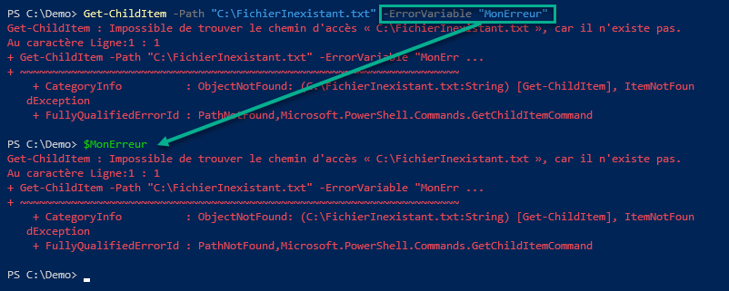
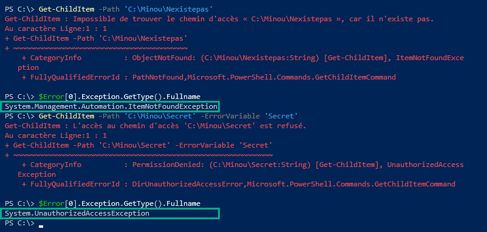
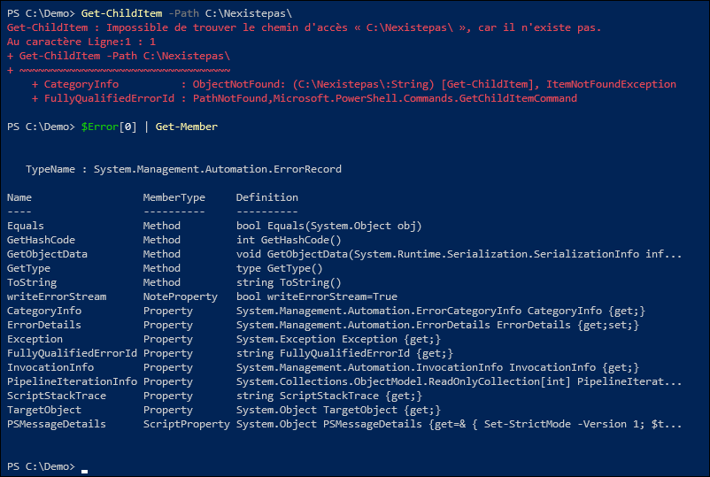
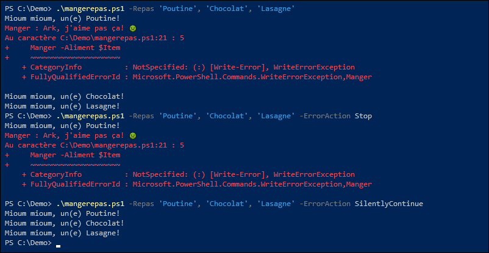

import Tabs from '@theme/Tabs';
import TabItem from '@theme/TabItem';

# Rencontre 8 - Erreurs

:::note Résumé de la séance

<Tabs>

<TabItem value="deroulement" label="👨‍🏫 Déroulement du cours">

1. Mécanismes de signalement
1. Les structures d'objets *ErrorRecord* et variable *$Error*
1. Action en cas d'erreur (*ErrorAction*, *ErrorActionPreference*)
1. Traitement des erreurs (structure *Try/Catch*, instruction *trap*, variable *$?*)
1. Propriétés des erreurs
1. Lancement d'erreurs avec l'instruction *throw* et la commande *Write-Error*

</TabItem>

<TabItem value="exercices" label="💻 Exercices à compléter">

- Exercice 07 - Erreurs
- Exercice 08 - Refactoring

</TabItem>

<TabItem value="ressources" label="📚 Ressources à consulter">

La présentation PowerPoint est sur le Teams du cours, sous le canal Général > Fichiers > Supports de cours.

</TabItem>

</Tabs>

:::

La gestion des erreurs est une considération fondamentale lorsqu'il s'agit de développer des scripts d'automatisation. Une multitude d'erreurs peuvent survenir lors de l'exécution d'un script:

- Un fichier d'entrée est inexistant ou corrompu
- Un serveur n'est pas accessible
- L'utilisateur n'a pas les privilèges suffisants
- Etc.

Si on ne prévoit pas la possibilité de ces erreurs dans le script, on s'expose au risque que le script ou la tâche ne se réalise pas, ou pire, qu'elle se réalise partiellement ou incorrectement. Il est absolument essentiel de contrôler tous les cas d'erreur.

Lorsqu'on développe un script, on doit imaginer tous les scénarios où une erreur pourrait survenir, et les traiter adéquatement.


## Mécanismes de signalement d'erreurs

Lorsqu'une commande (ou un script, ou une fonction) rencontre une situation où elle ne peut pas effectuer sa tâche avec succès, elle signale une erreur à l'hôte qui l'appelle. PowerShell fournit deux mécanismes permettant de signaler des erreurs: un mécanisme permettant de mettre fin à l'exécution lorsqu'une erreur est signalée et un autre mécanisme pour qu'une erreur soit signalée sans pour autant interrompre l'exécution.

Les **erreurs avec fin d'exécution** (*terminating error*) causent un arrêt immédiat de l'exécution du script, de la fonction ou du pipeline. On peut lancer une erreur de fin d'exécution à l'aide de l'instruction `throw`.

Les **erreurs sans fin d'exécution** (*non-terminating error*) sont signalées et s'affichent généralement dans la console tout comme les erreurs avec fin d'exécution et la commande à l'origine de l'erreur ne donne pas de résultat, mais l'exécution du script continue. On peut lancer une erreur sans fin d'exécution à l'aide de la commande `Write-Error`.

La plupart des erreurs sont *non-terminating* par défaut. C'est pourquoi il n'est pas rare, surtout lorsqu'on travaille avec une boucle ou une collection d'objets, de voir de nombreuses erreurs s'afficher d'un coup dans la console.


## Objets *ErrorRecord*

Pour PowerShell, une erreur est un objet. Lorsqu'une commande rencontre une erreur, celle-ci émet un objet de type `[System.Management.Automation.ErrorRecord]`. Les erreurs circulent dans un *pipeline* spécial, appelé "*error stream*".

Les erreurs s'affichent généralement en rouge dans la console lorsqu'elles sont lancées. Elles contiennent des informations utiles pour le diagnostic, notamment:

- Le message d'erreur
- Un extrait de la ligne de code ayant déclenché l'erreur
- L'emplacement dans le code où l'erreur a été déclenchée (numéro de ligne et de caractère)
- Le type de l'erreur (la classe .NET de laquelle l'erreur est dérivée)
- La catégorie d'erreur


### Affichage des erreurs

Windows PowerShell 5.1 offre deux mode d'affichage des erreurs: ***NormalView*** et ***CategoryView***. Le mode *NormalView* est défini par défaut dans la variable `$ErrorView`.


Cette vue est la plus complète. On peut y trouver entre autres le message d'erreur, le numéro de ligne où l'erreur a été déclenchée, la commande en erreur, la catégorie et le type de l'erreur.

Il est possible de modifier cette préférence à un mode d'affichage plus succint. Pour ce faire, il suffit de modifier la valeur de la variable `$ErrorView = 'CategoryView'`.


:::info
Les versions ultérieures de PowerShell offrent également un mode d'affichage compact *ConciseView*, qui est également le mode par défaut. Par conséquent, si vous utilisez PowerShell 7, il se peut que les erreurs ne s'affichent pas de la même manière.


:::


### Stockage des erreurs dans une variable

Les erreurs sont des objets de type `[ErrorRecord]`. On peut les analyser plus en détails en explorant leur structure de données interne. Pour ce faire, on affecte l'objet représentant l'erreur dans une variable afin d'accéder à l'objet.

La variable `$Error` est une variable système gérée par PowerShell, qui contient la liste de toutes les erreurs qui sont survenues dans la session en cours. Il s'agit d'une variable de type *Array*. Les erreurs y sont représentées dans l'ordre de la plus récente à la plus ancienne. Ainsi, `$Error[0]` contient l'erreur la plus récente, `$Error[1]` la deuxième plus récente, et ainsi de suite.


Alternativement, on peut enregistrer l'erreur déclenchée par une commande dans une variable de notre choix, au moyen du paramètre `-ErrorVariable`.




:::tip
On peut vider la variable `$Error` en appelant sa méthode `.Clear()`.


:::


## Action en cas d'erreur

Il est possible de déterminer le comportement que PowerShell doit adopter en cas d'erreur sans fin d'exécution (*non-terminating*). Les actions possibles sont:

| Action | Effet |
| -- | -- |
| Stop | Arrêt immédiat du script ou de la fonction |
| Continue | Le script ou la fonction affiche signale une erreur mais poursuit son exécution (c'est le comportement par défaut) |
| SilentlyContinue | Le script continue et n'affiche aucun message d'erreur, mais l'erreur est tout de même envoyée dans `$error`. |
| Ignore | Ignore les erreurs sans aucun signalement. (Cette valeur est inadmissible dans `$ErrorActionPreference`.) |
| Inquire | Le script affiche le message d'erreur et demande à l'utilisateur s'il souhaite continuer ou arrêter. |

Il y a deux manières de modifier le comportement en cas d'erreur: globalement grâce à la variable `$ErrorActionPreference` ou au cas par cas avec le paramètre `-ErrorAction`.


### Paramètre *ErrorAction*

On peut choisir l'action à effectuer en cas d'erreur en définissant le paramètre `-ErrorAction` de la commande.

Le paramètre `-ErrorAction` fait partie des paramètre communs à toutes les commandes (*cmdlets*). Cette action ne concerne que cette commande, et n'altère en rien les autres commandes.

Par exemple, la commande `Get-LocalUser` donne une erreur lorsque le compte utilisateur local recherché n'existe pas.


L'erreur peut être cachée lorsqu'on spécifie `-ErrorAction SilentlyContinue`. Dans ce cas, même si l'erreur n'a pas été affichée à l'écran, les informations sur l'erreur peuvent quand même être récupérées par la variable `$Error`.


Lorsqu'on ignore une erreur lancée par une commande, cette dernière échoue quand même son exécution. Si, par exemple, cette commande devait affecter une valeur à une variable, l'échec de la commande entraîne un échec d'affectation. On se retrouve alors avec un objet nul, représenté par le symbole `$null`. On peut utiliser ce comportement à notre avantage, en ignorant l'erreur et en vérifiant si la variable contient une valeur ou possède une valeur nulle. Par exemple, la fonction suivante teste l'existence d'un utilisateur local en exploitant cette propriété.


### Variable *$ErrorActionPreference*

On peut définir globalement le comportement à adopter en cas d'erreur grâce à la variable `$ErrorActionPreference`. Les valeurs admissibles sont les même qu'avec le paramètre `-ErrorAction`, à l'exception de la valeur **Ignore**, qui ne peut être définie globalement.

L'action **Continue** est définie par défaut lorsqu'on démarre une session PowerShell, comme en témoigne la valeur de la variable `$ErrorActionPreference`.


Conséquemment, lorsqu'une commande génère une erreur, l'objet qui représente l'erreur est affiché dans la console et est envoyé dans la variable `$error`, puis le pipeline, le script ou la fonction continue son exécution, comme on peut observer dans l'exemple suivant.


Pour changer le comportement globalement, il suffit de modifier la variable `$ErrorActionPreference`. Par exemple, si on lui affecte **Stop**, les erreurs 


Or, si on lui affecte **SilentlyContinue**, les erreurs ne s'affichent pas et l'exécution se poursuit normalement.


:::caution
Ce changement ne vaut que pour la session en cours. Si on ouvre une nouvelle session PowerShell, la variable revient à sa valeur initiale, **Continue**.
:::


## Traitement des erreurs

Les erreurs sont très pratiques, car elles permettent au script de poser certaines actions et ainsi traiter les cas d'erreur.

Voici quelques scénarios:
- Le script prend un chemin de répertoire en paramètre. Si le répertoire n'existe pas, le script le crée automatiquement.
- Le script prend en paramètre un fichier pour écrire dessus. Si on n'a pas la permission de modifier le fichier, il en crée une copie sur le bureau ou dans un répertoire où l'utilisateur a accès en écriture.
- Le script lance plusieurs commandes. Si une commande échoue, on crée un événement dans le journal.
- Le script vérifie si l'utilisateur possède des droits admin, et si non, il plante.
- Etc.

Il existe plusieurs stratégies qui permettent de réagir à une erreur au sein d'un script ou d'une fonction.

### La variable *$?*

Une manière toute simple d'identifier s'il y a eu une erreur consiste à utiliser la variable `$?`.

La variable `$?` est gérée par PowerShell et contient une valeur booléenne qui représente le succès ou l'échec de la dernière commande. Elle prend la valeur `$True` si la dernière commande s'est complétée avec succès, et `$False` s'il y a eu une erreur.


Celle-ci reflétant le succès de la dernière commande, le simple fait de la consulter a pour effet de la redéfinir. Il faut donc la consulter immédiatement.


:::info
La variable $? fonctionne pour les commandes PowerShell, mais également pour les commandes externes comme les fichiers exécutables qu'on lance au moyen de l'opérateur d'appel `&`.


:::


### La structure *Try/Catch*

Tout comme en C# (et bien d'autres langages de programmation), on peut utiliser la structure *Try/Catch* pour traiter les erreurs. Il s'agit de la manière la plus flexible et efficace de gérer les erreurs.

Pour intercepter les erreurs, il est important que l'erreur déclenche l'arrêt du traitement. Les erreurs de fin d'exécution (*terminating*) sont toujours interceptées. Pour les erreurs régulières (*non-terminating*), il faut qu'elles déclenchent l'action **Stop**, soit en spécifiant le paramètre `-ErrorAction Stop`, soit en affectant la valeur "**Stop**" à la variable `$ErrorActionPreference`.

Dans le code, on déclare un bloc `try {...}` dans lequel on insère une ou plusieurs lignes de code. Dès qu'une erreur vient interrompre le cours normal d'exécution, le traitement du bloc `try` se termine immédiatement et le code contenu dans le bloc `catch {...}` est exécuté.

À l'intérieur du bloc `catch {...}`, la variable pipeline `$_` (ou `$PSItem`) permet d'accéder à l'objet représentant l'erreur qui a été levée.

Voici un exemple d'application d'une structure *try/catch*:

```powershell
param(
    [Parameter(ValueFromPipeline)] [string] $Path = (Get-Location)
)

Write-Host "Début de l'exécution du script!" -ForegroundColor Cyan

try {
    Write-Host "Je tente d'afficher le contenu du répertoire $Path" -ForegroundColor Green
    Get-ChildItem -Path $Path -ErrorAction Stop
    Write-Host "J'ai terminé d'afficher le contenu du répertoire $Path" -ForegroundColor Green
}
catch {
    Write-Host "Je ne peux pas afficher le contenu du répertoire $Path" -ForegroundColor Red
    Write-Host "Détails de l'erreur: $($_.CategoryInfo)" -ForegroundColor Red
}

Write-Host "Fin de l'exécution du script!" -ForegroundColor Cyan
```

Lorsqu'il n'y a aucune erreur émise lors de l'exécution du bloc `try {...}`, les commandes inscrites dans le bloc `catch {...}` ne sont jamais exécutées.


Or, lorsqu'une erreur est lancée dans le bloc `try {...}`, celui-ci interrompt son exécution dès que l'erreur est rencontrée, et le flot de contrôle saute immédiatement dans le bloc `catch {...}`. Dans ce bloc, la variable `$_` permet d'obtenir de l'information sur l'erreur qui a été déclenchée.


:::info
Optionnellement, on peut définir un bloc `finally {...}`, qui sera exécuté en tout temps, qu'il y ait eu une erreur ou non. Le bloc `finally {...}` est principalement utilisé pour libérer des ressources qui auraient pu être utilisées dans le bloc `try {...}`. Bien que l'effet réel du bloc `finally {...}` soit généralement le même à simplement ajouter du code à l'extérieur de la structure *try/catch*, il a l'avantage de garantir que le code soit exécuté. En fait, il est exécuté même si l'utilisateur interrompt l'exécution avec les touches `Ctrl+C`.
:::


### *Try/Catch* ciblé par type d'exception

En PowerShell, les erreurs sont des objets de type `ErrorRecord` qui encapsulent une exception .NET dans leur propriété `.Exception`. Chaque exception .NET est issue d'une classe d'exception. La plupart des commandes PowerShell génèrent des exceptions qui implémentent l'une ou l'autre des classes admissibles.

Pour connaître le type d'une exception, il suffit de vérifier le type de la propriété `.Exception` de l'erreur.



On peut optionnellement déclarer plusieurs blocs `catch` pour un seul bloc `try`. Les blocs `catch` supplémentaires doivent spécifier un ou plusieurs **types** d'erreur.

Le script suivant 

```powershell
param(
    [Parameter(ValueFromPipeline)] [string] $Path = (Get-Location)
)

Write-Host "Début de l'exécution du script!" -ForegroundColor Cyan

try {
    Write-Host "Je tente d'afficher le contenu du répertoire $Path" -ForegroundColor Green
    Get-ChildItem -Path $Path -Directory -ErrorAction Stop
    Write-Host "J'ai terminé d'afficher le contenu du répertoire $Path" -ForegroundColor Green
}
catch [System.Management.Automation.ItemNotFoundException] {
    Write-Host "Le chemin n'existe pas!" -ForegroundColor Red
}
catch [System.UnauthorizedAccessException] {
    Write-Host "Accès refusé!" -ForegroundColor Red
}
catch {
    Write-Host "Autre erreur!" -ForegroundColor Red
    Write-Host "Détails de l'erreur: $($_.CategoryInfo)" -ForegroundColor Red
}

Write-Host "Fin de l'exécution du script!" -ForegroundColor Cyan
```


:::caution
Ce ne sont pas toutes les erreurs qui possèdent un type d'exception spécifique. Certaines commandes lancent des erreurs de type générique. Avant d'utiliser cette technique, il faut analyser les différents types d'erreurs qui sont générés. Les erreurs PowerShell possèdent d'autres propriétés qui permettent de les distinguer, comme la catégorie. Cependant, on ne peut pas les utiliser de la même manière que le type. Pour les utiliser, on n'a pas d'autre choix que de recourir à des conditions (*if*) au sein d'un blocs `catch`.
:::


### L'instruction *Trap*

On peut utiliser l'instruction `Trap` pour exécuter du code dès qu'une erreur survient. C'est en quelque sorte un piège à erreurs.

Pour qu'elle tombe dans le piège, il est important que l'erreur puisse déclencher l'arrêt du traitement. Les erreurs de fin d'exécution (*terminating*) tombent automatiquement dans le piège. Pour les erreurs régulières, il faut qu'elles déclenchent l'action Stop, soit en spécifiant le paramètre `-ErrorAction Stop`, soit en affectant la valeur "**Stop**" à la variable `$ErrorActionPreference`.

Dans l'exemple suivant, si la commande `Get-ChildItem` retourne une erreur (par exemple, en lui fournissant un chemin qui n'existe pas), tout le code contenu dans le bloc trap sera exécuté.

```powershell
trap {
    "Une erreur est survenue!: '$($_.CategoryInfo)'" | Write-Host -ForegroundColor Cyan
}
$Path = 'C:\Nexistepas.txt'
Write-Host "Je tente d'accéder à '$Path'..."
Get-ChildItem -Path $Path -ErrorAction Stop
Write-Host "Fin!"
```

Lorsque ce code est exécuté, Get-ChildItem cause une erreur, ce qui cause l'interruption du script et saute dans le bloc `trap`. Le code défini dans le bloc est exécuté, puis le contrôle retourne au script principal. L'erreur générée par Get-ChildItem est affichée normalement puis le script poursuit son exécution.


#### Instruction *break*

Dans le bloc trap, on peut utiliser l'instruction `break` pour que le script termine immédiatement son exécution.

```powershell
trap {
    "Une erreur est survenue!: '$($_.CategoryInfo)'" | Write-Host -ForegroundColor Cyan
    break
}
$Path = 'C:\Nexistepas.txt'
Write-Host "Je tente d'accéder à '$Path'..."
Get-ChildItem -Path $Path -ErrorAction Stop
Write-Host "Fin!"
```

Dans ce cas, le message "Fin!" n'est jamais affiché puisque le script s'arrête dès que l'instruction `break` est appelée à partir du bloc `trap`.


#### Instruction *continue*

On peut aussi utiliser l'instruction `continue` pour "approuver" l'erreur. Le script poursuivra ainsi son exécution sans que l'erreur ne soit affichée.

```powershell
trap {
    "Une erreur est survenue!: '$($_.CategoryInfo)'" | Write-Host -ForegroundColor Cyan
    continue
}
$Path = 'C:\Nexistepas.txt'
Write-Host "Je tente d'accéder à '$Path'..."
Get-ChildItem -Path $Path -ErrorAction Stop
Write-Host "Fin!"
```

Dans ce cas, l'erreur ne s'affiche pas puisque l'instruction `continue` permet d'invalider l'erreur. Le cours normal de l'exécution du script se poursuit comme si aucune erreur n'était survenue.


## Analyse d'une erreur

Comme les erreurs sont des objets, celles-ci possèdent des attributs et des méthodes.



Voici quelques propriétés intéressantes:

| Exception | Contient les détails de l'exception. |
| -- | -- |
| FullyQualifiedErrorId | L'identification de l'erreur |
| CategoryInfo | La catégorie de l'erreur |
| TargetObject | L'objet qui a provoqué l'erreur |
| InvocationInfo | Le contexte de l'erreur (par exemple, à quelle ligne du script l'erreur est survenue, etc.) |
| ScriptStackTrace | Le stack trace, c'est-à-dire toute la pile d'appels qui ont mené à l'erreur |


Voici un exemple d'erreur:


On peut fouiller dans les différentes propriétés de l'erreur pour trouver de l'information utile, notamment dans les propriétés `.Exception`, `.CategoryInfo` et `.InvocationInfo`.


Voici quelques exemples d'informations qu'un peut extraire d'un objet `ErrorRecord`:

| Propriété | Valeur |
| -- | -- |
| `.Exception.Message` | Le message d'erreur, affiché dans la langue du système. |
| `.CategoryInfo.Category` | La catégorie de l'erreur (par exemple, `ObjectNotFound`). |
| `.CategoryInfo.Reason` | Le type de l'exception (par exemple, `ItemNotFoundException`). |
| `.CategoryInfo.Activity` | La commande qui a déclenché l'erreur. |
| `.TargetObject` | Le nom de la ressource ayant déclenché l'erreur. |
| `.InvocationInfo.ScriptLineNumber` | Le numéro de la ligne du script qui a déclenché l'erreur. |
| `.InvocationInfo.Line` | La ligne de code qui a déclenché l'erreur. |


Dans un bloc *Try/Catch* ou un bloc *Trap*, on peut obtenir de l'information sur les erreurs au moyen de la variable pipeline `$_` (ou `$PSItem`).

```powershell
param(
    [Parameter(ValueFromPipeline)] [string] $Path = (Get-Location)
)

try {
    Get-ChildItem -Path $Path -Directory -ErrorAction Stop
}
catch {
    Write-Host "Une erreur a été rencontrée!"
    Write-Host "Message:", $_.Exception.Message
    Write-Host "Catégorie:", $_.CategoryInfo.Category
    Write-Host "Raison:", $_.CategoryInfo.Reason
    Write-Host "Commande:", $_.CategoryInfo.Activity
    Write-Host "Cible:", $_.TargetObject
    Write-Host "Numéro de ligne:", $_.InvocationInfo.ScriptLineNumber
    Write-Host "Ligne de code:", $_.InvocationInfo.Line
}
```

Dans le bloc `catch`, on peut récupérer les propriétés de l'erreur, qu'on accède avec `$_`.


:::tip
Lorsque vous programmez votre script et que vous souhaitez analyser plus en détails les erreurs qui déclenchent votre bloc `catch`, mettez un point d'arrêt à l'intérieur du bloc `catch`. Lorsque votre script est en mode débogage, vous aurez le loisir d'explorer la variable `$_` à travers la console ou le panneau d'exécution de Visual Studio Code.


:::


## Création d'erreurs

Il est possible de programmer votre script pour qu'il lance lui-même des erreurs. Pour ce faire, on a deux options:
- L'instruction `throw` génère une erreur de fin d'exécution (*terminating*)
- La commande `Write-Error` génère une erreur régulière (*non-terminating*)

### Instruction *throw*

Vous pouvez lancer une erreur de fin d'exécution à l'aide de l'instruction `throw`. Vous pouvez utiliser cette technique dans une fonction ou un script, ce qui laisse la responsabilité à l'hôte de traiter l'erreur.

```powershell
param(
    [string[]] $Repas
)

function Manger {
    Param(
        [string] $Aliment
    )

    if ($Aliment -eq "Chocolat") {
        # Vincent est bizarre, il n'aime pas le chocolat!
        throw "Ark, j'aime pas ça! 🤢"
    }

    Write-Host "Mioum mioum, un(e) $Aliment!"

}

foreach ($Item in $Repas) {
    Manger -Aliment $Item -ErrorAction Stop
}
```

Dans le script ci-dessus, on spécifie plusieurs aliments au script, qui les passe un par un dans la fonction `Manger`. Si l'aliment est du chocolat, une erreut est lancée. Puisque l'instruction `throw` génère une erreur de fin d'exécution, celle-ci interrompt immédiatement l'exécution du script.


On peut éviter d'interrompre l'exécution du script en traitant cette erreur, par exemple avec l'ajout d'un bloc *Try/Catch*.

```powershell
Param(
    [string[]] $Repas
)

function Manger {
    Param(
        [string] $Aliment
    )

    if ($Aliment -eq "Chocolat") {
        # Vincent est bizarre, il n'aime pas le chocolat!
        throw "Ark, j'aime pas ça! 🤢"
    }

    Write-Host "Mioum mioum, un(e) $Aliment!"
}

foreach ($Item in $Repas) {
    try {
        Manger -Aliment $Item
    }
    catch {
        Write-Host "Non, je ne mangerai pas de $Item!"
    }
}
```

Dans ce cas, l'erreur n'a pas été affichée car elle a été attrapée par le bloc `catch`. PowerShell la considère donc traitée.


### Instruction *Write-Error*

Pour lancer une erreur régulière, se comportant comme la plupart des erreurs générées par des commandes PowerShell, on peut utiliser la commande `Write-Error` au lieu de l'instruction `throw`. Ces erreurs sont pratiques si vous souhaitez que votre script se comporte comme un *cmdlet* PowerShell, réagisse à la variable `$ErrorActionPreference` et offre un paramètre `-ErrorAction`.

Pour ce faire, votre script ou fonction doit être déclaré comme un *cmdlet*. Il suffit d'ajouter la ligne `[CmdletBinding()]` juste avant le bloc `param()`. Cela aura pour effet d'ajouter tous les paramètres communs aux *cmdlets*, incluant `-ErrorAction`.

```powershell
[CmdletBinding()]
Param(
    [string[]] $Repas
)

function Manger {
    Param(
        [string] $Aliment
    )

    if ($Aliment -eq "Chocolat") {
        # Vincent est bizarre, il n'aime pas le chocolat!
        Write-Error "Ark, j'aime pas ça! 🤢"
    }

    Write-Host "Mioum mioum, un(e) $Aliment!"

}

foreach ($Item in $Repas) {
    Manger -Aliment $Item
}
```




## Erreurs provenant de commandes externes

Les erreurs PowerShell ne valent que pour les commandes PowerShell ou les appels à des classes et objets .NET. Les commandes externes qui échouent leur programme, comme `ping.exe 192.168.0.1701`, ne retournent pas d'erreur PowerShell, même si elles sont effectivement en erreur. On va plutôt regarder leur code de retour pour savoir si elles ont été exécutées avec succès ou non.

Lorsqu'un programme exécutable termine son exécution, il communique au système d'exploitation une valeur numérique qu'on appelle le **code de retour**. Par convention, un code de 0 signifie que le programme s'est terminé sans erreur, alors qu'un code de n'importe quelle autre valeur signifie qu'il y a eu une erreur ou une anomalie. 

:::info
Certains programmes vont utiliser un code de 1 pour n'importe quelle erreur, d'autres vont utiliser une multitude de codes différents en fonction de la cause de l'erreur. Finalement, certains programmes peuvent utiliser des codes de retour autres que 0 pour un succès mitigé (par exemple, msiexec.exe retourne 3010 lorsque l'installation est réussie mais exige un redémarrage). Mais dans tous les cas, 0 signifie un succès.
:::

### Lancement direct ou avec l'opérateur d'appel

Pour tester le succès d'une commande externe appelée directement ou au moyen de l'opérateur d'appel `&`, on peut utiliser la variable `$?` pour connaître le succès ou l'échec de l'exécution, ainsi que la variable `$LASTEXITCODE` pour obtenir le code de retour de la dernière commande. Il faut la lire rapidement toutefois, car si une autre commande est lancée, la valeur de la variable sera remplacée.


### Lancement avec la commande *Start-Process*

Lorsque la commande externe est appelée par la commande `Start-Process`, les variables `$?` et `$LASTEXITCODE` ne sont pas utilisées. À la place, on doit se garder une copie de l'objet décrivant le processus en activant le switch `-PassThru`. Puis une fois le processus terminé, le code de retour est accessible via sa propriété `.ExitCode`.


:::info
Dans l'invite de commande classique (cmd.exe), on peut connaître le code de retour en consultant la variable `%errorlevel%`.


:::

