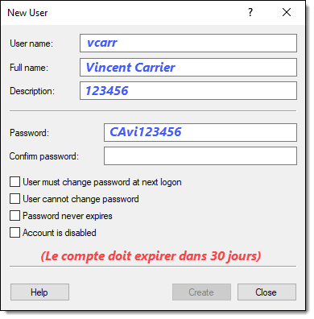
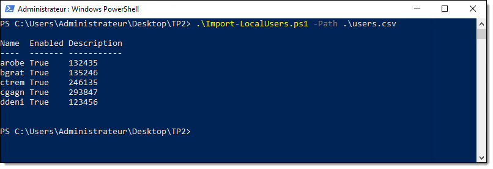
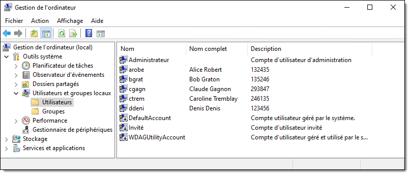
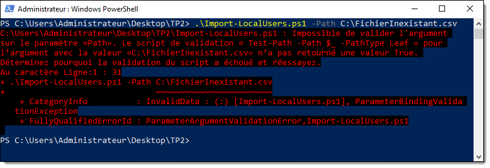
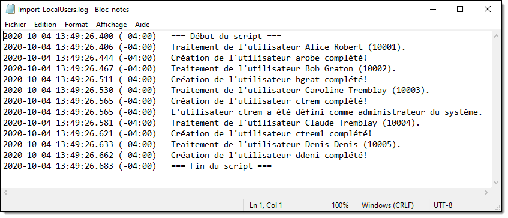
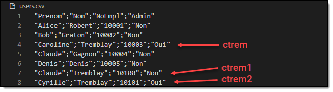

# Travail pratique #1 (A2023)

Ce TP est à faire individuellement. Il compte pour **20%** de la note du cours. La remise doit obligatoirement se faire par GitHub Classroom.

## Mandat

Vous devez développer un script PowerShell qui vise à créer des utilisateurs **locaux** en lot sous Windows 10, définis dans un fichier CSV.

### Le fichier d’entrée

Le fichier CSV est construit dans le format suivant, séparé par des points-virgules :

```
"Prenom";"Nom";"NoEmpl";"Admin"
"Alice";"Robert";"10001";"Non"
"Bob";"Graton";"10002";"Non"
"Caroline";"Tremblay";"10003";"Oui"
"Claude";"Gagnon";"10004";"Non"
"Denis";"Denis";"10005";"Non"
"Claude";"Tremblay";"10100";"Non"
"Cyrille";"Tremblay";"10101";"Oui"
```
 
On y trouve le prénom, le nom et le numéro d’employé de chaque utilisateur à créer, ainsi qu’un champ identifiant si l’utilisateur doit être administrateur du système (oui ou non).

Deux fichiers vous sont fournis : users.csv et users2.csv. Le premier ne contient aucun conflit de nom, le deuxième en contient. Je vous les fournis ainsi pour faciliter vos tests. J’utiliserai un autre fichier avec des utilisateurs différents pour la correction, et je m’attends à ce que votre script fonctionne tout aussi bien.

:::info
Notez que je n’exige pas que votre script fonctionne pour les utilisateurs dont le nom de famille est inférieur à 4 lettres. Dans mon fichier de correction, tous les utilisateurs ont un nom de famille d’au moins 4 lettres.
:::

### Comptes utilisateurs

Votre script devra créer un compte local pour chaque utilisateur spécifié dans ce fichier. Voici les consignes :

- Le **nom d’utilisateur** doit être la première lettre du prénom et les 4 premières du nom de famille, en **lettres minuscules**. (Dans ce travail, il n’y aura pas de noms de famille de moins de 4 caractères).

- Le **nom complet** de l’utilisateur est son prénom suivi de son nom

- La **Description** de l’utilisateur est son numéro d’employé

- Le **mot de passe** doit être les 2 premières lettres du nom de famille en **majuscules**, les 2 premières lettres du prénom en **minuscules**, suivi du numéro d’employé.

- Si l’utilisateur doit être **admin**, il doit être ajouté au groupe des **administrateurs** du système, sinon il doit être dans le groupe des **utilisateurs réguliers**.

- Le compte doit expirer **dans 30 jours**.




:::info
Les commandes à utiliser sont celles du module [microsoft.powershell.localaccounts](https://docs.microsoft.com/fr-ca/powershell/module/microsoft.powershell.localaccounts/?view=powershell-5.1). Celles-ci pourraient particulièrement vous intéresser :
- [Get-LocalUser](https://docs.microsoft.com/fr-ca/powershell/module/microsoft.powershell.localaccounts/get-localuser?view=powershell-5.1)
- [New-LocalUser](https://docs.microsoft.com/fr-ca/powershell/module/microsoft.powershell.localaccounts/new-localuser?view=powershell-5.1)
- [Get-LocalGroup](https://docs.microsoft.com/fr-ca/powershell/module/microsoft.powershell.localaccounts/get-localgroup?view=powershell-5.1)
- [Get-LocalGroupMember](https://docs.microsoft.com/fr-ca/powershell/module/microsoft.powershell.localaccounts/get-localgroupmember?view=powershell-5.1)
- [Add-LocalGroupMember](https://docs.microsoft.com/fr-ca/powershell/module/microsoft.powershell.localaccounts/add-localgroupmember?view=powershell-5.1)
:::


### Lancement du script

Le script doit rouler en tant qu’administrateur. Si vous testez le script sans droits admin, il est normal qu’il ne fonctionne pas. **Il n’est pas demandé que votre script valide s’il est lancé en admin ou demande une élévation**.

Le script doit **exiger** un paramètre `-Path` (obligatoire) dans lequel on spécifie le chemin du fichier CSV à charger. Le script doit alors créer les utilisateurs locaux selon les paramètres indiqués dans le fichier. Il doit aussi retourner les comptes utilisateurs créés dans le pipeline. On doit aussi pouvoir passer le chemin par l’entrée du pipeline, au lieu de spécifier le paramètre `-Path`.



Les comptes ainsi créés devraient être visibles dans la console Computer Management (`compmgmt.msc` ou `lusrmgr.msc`).



 
### Validation du paramètre

Le script doit planter si le chemin spécifié en paramètre est invalide. Pour ce faire, vous devez utiliser les fonctionnalités de validation des paramètres de PowerShell.


 
### Journalisation

Le script doit aussi garder une trace de toutes les actions qu’il entreprend dans le fichier **Import-LocalUsers.log** :
- Début du script
- Traitement d’un utilisateur
- Création de l’utilisateur
- Ajout aux admins si nécessaire
- Fin du script

Chaque ligne doit être horodatée (timestamp) dans le format illustré, avec une précision en millisecondes et le fuseau horaire. Cette fonctionnalité doit être réalisée au moyen d’une **fonction**, et cette dernière doit avoir un maximum d’autonomie. Par ailleurs, le fichier doit être situé sous **C:\\Users\\*utilisateur*\\AppData\\Local\\Import-LocalUsers\\** (celui-ci doit être créé automatiquement s’il n’existe pas). Vous devez utiliser au maximum les variables d’environnement offertes par Windows.


 
### Traitement des conflits de noms

Lors du traitement des utilisateurs, il se peut qu’il y ait plusieurs utilisateurs qui portent des noms semblables, qui auraient des noms d’utilisateurs identiques. Programmez la logique nécessaire dans votre script pour que si un nom d’utilisateur doit être identique à un existant, il doit être suivi d’un 1, puis d'un 2, puis d’un 3, et ainsi de suite, comme illustré ci-dessous.



 
## Consignes

Vous devez remettre ce travail sur GitHub. Vous êtes libres d’utiliser le client Git de votre choix (VS Code, GitKraken, GitHub Desktop, SourceTree, git cli, etc.)

Vous avez **jusqu’à une semaine avant la remise** pour soumettre votre script pour une évaluation formative sur GitHub. Pour ce faire, faites un commit avec la description &laquo;&nbsp;Évaluation formative&nbsp;&raquo;. Je vous donnerai des commentaires sur ce que vous avez de fait.

:::caution
À moins d'une semaine de la remise finale, il sera trop tard pour la remise formative.
:::

## Conseils

Voici quelques conseils qui pourraient vous aider à mener à bien ce travail :
- Avant de commencer à coder, décrivez les étapes en pseudo-code pour déterminer la logique générale du script. Vous pourrez ensuite &laquo;&nbsp;traduire&nbsp;&raquo; ce pseudo-code en PowerShell, étape par étape.
- Utilisez une machine virtuelle pour tester votre script. Vous pouvez installer VS Code sur votre VM pour développer votre script.
- Lancez VS Code en tant qu’administrateur pour pouvoir tester votre script directement dans Code.
- Utilisez le paramètre `-WhatIf` pour tester votre script sans qu’une action réelle ne soit posée.
- Faites-vous un petit script de nettoyage pour effacer les utilisateurs créés en trop.
- Utilisez GitHub à votre avantage. Dès que vous avez réussi quelque chose dans votre script, faites un commit et un push dans GitHub. Vous pourrez ainsi profiter de l’historique.
- Testez des parties de votre script au lieu de lancer le script au complet à chaque fois. N’hésitez pas à tester les commandes toutes seules, définir des variables manuellement pour tester, etc.
 
## Critères d’évaluation

Le script sera évalué selon les critères suivants :

| Critère d'évaluation | Pondération |
| -- | -- |
| Conception et fonctionnement général | 10% |
| Paramètres du script | 10% |
| Traitement du fichier d’entrée | 5% |
| Création des utilisateurs | 40% |
| Journalisation | 10% |
| Lisibilité et documentation | 10% |
| Respect des consignes | 5% |
| Français écrit | 10% |
| **Total** | **100%** |


Voici les détails de ce qui sera évalué pour chaque critère:

- **Conception et fonctionnement général [10%]**
    - Le script fonctionne du premier coup
    - Aucune erreur n’est affichée pendant l’exécution
    - Logique générale du script (pas de code inutile ou redondant)
    - Respect des bonnes pratiques de programmation
- **Paramètres du script [10%]**
    - Définition des paramètres conformes à l’énoncé
    - Paramètre obligatoire
    - Validation de l’existence du fichier en entrée
    - Traitement du paramètre par l’entrée du pipeline
- **Traitement du fichier d’entrée [5%]**
    - Lecture juste du fichier CSV en entrée
    - Utilisation des commandes et paramètres appropriés
- **Création des utilisateurs [40%]**
    - Création correcte des comptes utilisateurs locaux
    - Le nom des utilisateurs est conforme à l’énoncé 
    - Utilisation adéquates des commandes
    - Ajout des comptes non-admins au groupe des utilisateurs
    - Ajout des comptes admin au groupe des administrateurs
    - Les conflits de noms sont résolus conformément à l’énoncé
- **Journalisation [10%]**
    - Écriture des étapes d’exécution dans un fichier log
    - Emploi d’une fonction de journalisation
    - Autonomie de la fonction
    - Emplacement du fichier log conforme à la demande
    - Utilisation adéquate des variables d’environnement
- **Lisibilité et documentation [10%]**
    - Choix judicieux des noms de variables et de fonctions
    - Utilisation judicieuse des commentaires
    - Indentation correcte
    - Propreté du code
- **Respect des consignes [5%]**
    - Remise du script sur GitHub tel que demandé
    - Nom du script et des paramètres tel que demandé
- **Français écrit [10%]**
    - L’évaluation du français porte sur les commentaires et la description des commit dans GitHub
    - Voir la grille d’évaluation du français écrit, dans le plan de cours
