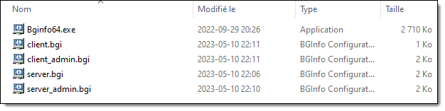
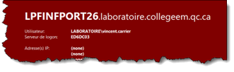
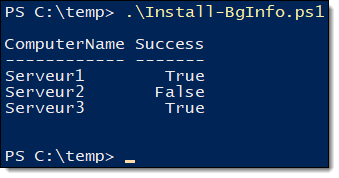

# Travail pratique #2 (A2023)

Ce TP est à faire individuellement. Il compte pour **20%** de la note du cours. La remise doit obligatoirement se faire par GitHub Classroom.

## Partie 1: Script de lancement de BGInfo

**Nom du script: `Invoke-BGInfo.ps1`**

Vous devez implanter l’outil BGInfo (faisant partie de la suite Sysinternals de Microsoft) dans votre environnement de serveurs et de postes de travail Windows. Cet outil sert à modifier le fond d’écran pour y ajouter de l’information technique comme le nom de la machine, le domaine, le nom d’utilisateur, la configuration IP, etc.

L’outil Bginfo64.exe ainsi que quatre fichiers .bgi vous sont fournis pour ce TP via le lien GitHub. Les fichiers `.BGI` décrivent comment l’outil doit se comporter, soit l’information à afficher, la couleur du fond d’écran, etc.



Pour appliquer un fichier BGI, vous devez le spécifier en paramètre à l’outil par ligne de commande. Voici la commande à utiliser, qui doit être lancée dans le contexte de l’utilisateur :

```
"C:\chemin\vers\Bginfo64.exe" "C:\chemin\vers\fichier.bgi" /timer:0 /nolicprompt
```

La première partie du TP consistera à développer un script qui lance la commande de l’outil en lui fournissant un fichier BGI en fonction de deux critères :
- Si l’utilisateur courant est membre du groupe local des administrateurs (`S-1-5-32-544`) ou non;
- Si la machine est un client ou un serveur. (Vous devez le vérifier par une requête WMI) 

| Condition | Fichier BGI | Aperçu |
| -- | -- | -- |
| La machine est un client, l’utilisateur n’est pas admin. (Le texte s’affiche par-dessus le fond d’écran) | Client.bgi |  |
| La machine est un client, l’utilisateur est admin. (Le fond d’écran est rouge) | Client-admin.bgi |  |
| La machine est un serveur, l’utilisateur n’est pas admin. (Le texte s’affiche par-dessus le fond d’écran) | Serveur.bgi |  |
| La machine est un serveur, l’utilisateur est admin. (Le fond d’écran est rouge) | Serveur-admin.bgi |  |


Ce script PowerShell devra se trouver au même endroit que `bginfo64.exe` ainsi que les fichiers `.BGI`. Il n’a pas à admettre de paramètres. Il doit simplement vérifier si l’ordinateur est un serveur ou un client, si l’utilisateur est admin ou non, et lancer la commande avec le bon fichier `.BGI`. Vous devez utiliser la variable `$PSScriptRoot` pour vous référer à l’emplacement de votre fichier `.PS1`.

Dans la partie 2 du TP, vous aurez à configurer à distance l’ensemble des machines de votre environnement pour que ce script soit lancé automatiquement au démarrage d’une session utilisateur.

### Conseils

- Voici comment obtenir le nom d’utilisateur complet (incluant le domaine) :

    ```powershell
    [System.Security.Principal.WindowsIdentity]::GetCurrent().Name
    ```

- Voici une page de documentation qui risque de vous être utile : [Win32_ComputerSystem](https://learn.microsoft.com/en-us/windows/win32/cimwin32prov/win32-computersystem)

- Utilisez la commande `Start-Process` pour lancer votre commande ainsi que ses arguments
 

## Partie 2: Script de déploiement

**Nom du script: `Install-BGInfo.ps1`**

L’outil BGInfo sert à afficher de l’information sur le papier peint de Windows. Une fois l’outil lancé, ce texte ne sera pas mis à jour avant que l’outil soit lancé de nouveau. Il est donc recommandé de planifier son lancement au démarrage d’une session utilisateur.

Votre mandat consiste à développer un script PowerShell pour "installer" BGInfo à distance sur une ou plusieurs machines du domaine.
Le script devrait s’utiliser ainsi :

```powershell
.\Install-BgInfo.ps1 -ComputerName "Serveur1"
```

Il doit pouvoir également admettre plusieurs ordinateurs dans son paramètre `-ComputerName`.

```powershell
.\Install-BgInfo.ps1 -ComputerName "Serveur1","Serveur2","Serveur3"
```

### Principe d’action

Votre script doit effectuer les tâches suivantes, pour chaque ordinateur spécifié en paramètre :

- Copier tous les fichiers de votre solution d’application de BGInfo dans le répertoire `C:\Program Files\Bginfo\` de l’ordinateur cible (soit le fichier `bginfo.exe`, tous les fichiers `.BGI`, et votre script `PS1` que vous avez développé préalablement). Ce répertoire devra être créé s’il n’existe pas déjà.

  - Les fichiers à transférer doivent se trouver le sous-répertoire Invoke-BGInfo situé dans le même répertoire que ce script. Utilisez la variable `$PSScriptRoot` pour y accéder. N’utilisez jamais de chemin vers un profil utilisateur!

- Planifier l’exécution du script au démarrage de session de n’importe quel utilisateur du système avec une tâche planifiée devant être exécutée par le groupe des Utilisateurs (`S-1-5-32-545`)

**Vous devez obligatoirement utiliser des sessions PowerShell (`PSSession`) pour réaliser ce TP.**

Après exécution, le script doit retourner dans le pipeline un objet (`PSCustomObject`) pour chaque machine traitée, avec une propriété ComputerName qui identifie le nom de la machine, et une propriété Success contenant une valeur booléenne `$true` ou `$false` selon que le déploiement a été effectué avec succès ou non. 
 



## Exigences d'évaluation

L’évaluation de votre travail prendra en compte les critères suivants:

| Critère d'évaluation | Pondération |
| -- | -- |
| Fonctionnement du script `Install-BGInfo.ps1` | 30% |
| Fonctionnement du script `Invoke-BGInfo.ps1` | 30% |
| Logique et conception | 15% |
| Style et lisibilité | 10% |
| Respect des consignes de remise | 5% |
| Français écrit | 10% |
| **Total** | **100%** |


Voici les détails de ce qui sera évalué pour chaque critère:

- Fonctionnement du script `Install-BGInfo.ps1` (30%)
  - Toutes les fonctionnalités demandées doivent être implémentées et fonctionnelles
  - L’exécution du script doit être exempte de messages d’erreurs en rouge dans la console
  - Les paramètres doivent être validés lorsque possible

- Fonctionnement du script `Invoke-BGInfo.ps1` (30%)
  - Toutes les fonctionnalités demandées doivent être implémentées et fonctionnelles
  - L’exécution du script doit être exempte de messages d’erreurs en rouge dans la console
  - Les paramètres doivent être validés lorsque possible

- Logique et conception (15%)
  - Votre code doit être logique et éviter des tournures redondantes ou inutiles
  - Éviter les chemins absolus (et particulièrement ceux vers un profil utilisateur)
  - Le nom des commandes, des paramètres ainsi que la structure des objets doivent être conformes aux spécifications de l’énoncé

- Style et lisibilité (10%)
  - Les noms des variables et des fonctions doit être représentatif
  - Les commentaires doivent être pertinents
  - Le code doit être correctement indenté

- Respect des consignes de remise (5%)
  - La remise a été faite sur GitHub tel que demandé
  - Toutes les consignes sont respectées

- Français écrit (10%)
  - L’évaluation du français porte sur les commentaires et la description des commit dans GitHub
  - Voir la grille d’évaluation du français écrit, dans le plan de cours
