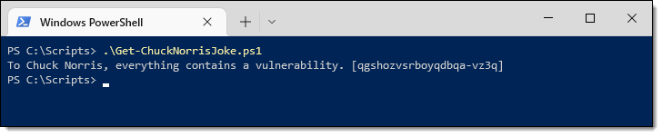
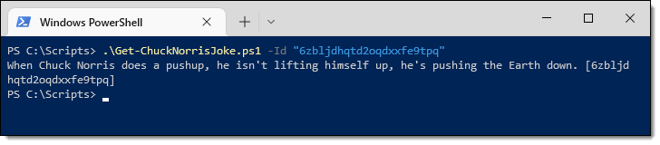
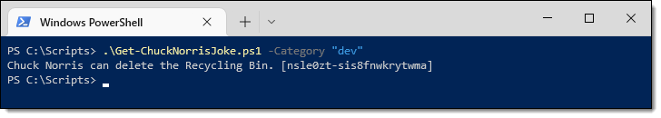
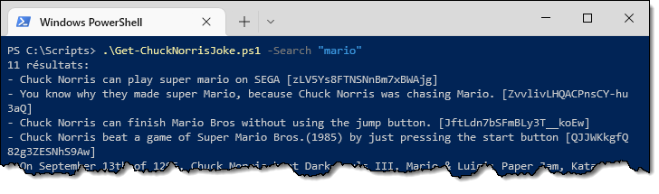
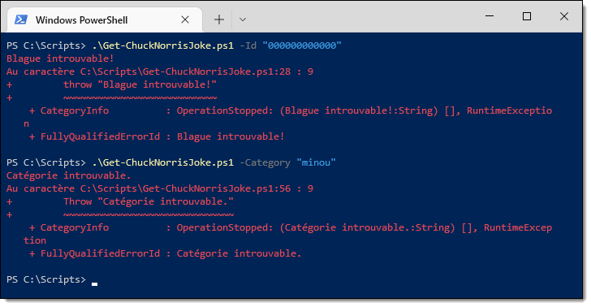
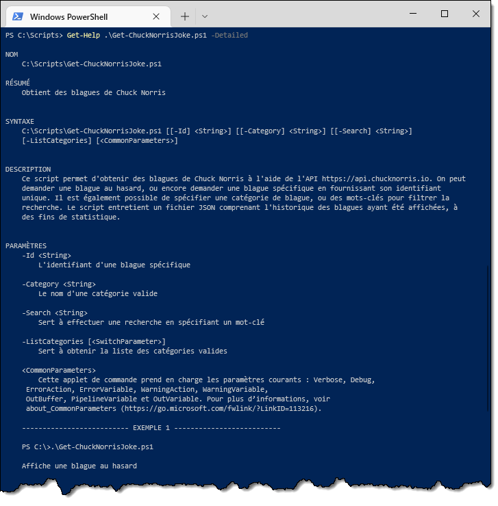
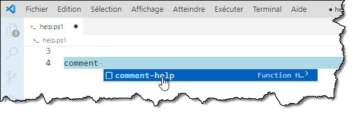

# Travail pratique #3 (A2023)


Ce TP est à faire individuellement. Il compte pour **15%** de la note du cours. La remise doit obligatoirement se faire par GitHub Classroom.


## Mandat

Votre patron vous demande de développer un script PowerShell permettant de raconter de bonnes vieilles blagues de Chuck Norris. 

Vous devez utiliser l’API **ChuckNorris.io** (https://api.chucknorris.io/) pour générer les blagues. Cette API prend des requêtes GET et retourne du contenu JSON.

Voici les fonctionnalités à implémenter (elles doivent se comporter **exactement** comme dans la capture d’écran) :


### Blague aléatoire

Lorsque le script est exécuté sans aucun paramètre, il affiche une blague au hasard. Le numéro d’identification unique de cette blague doit être écrit entre crochets à la fin de la blague, pour référence.


 
### Blague spécifique

Lorsqu’on passe le numéro d’identification d’une blague dans le paramètre `-Id`, la blague correspondante est affichée.




### Filtrage par catégorie

Si on spécifie le paramètre `-Category` suivi du nom d’une catégorie valide, une blague au hasard est affichée, mais seulement dans cette catégorie. Cela limite les choix possibles.




### Liste des catégories

On peut obtenir la liste des catégories valides en spécifiant le switch `-ListCategories`.


 
### Recherche de blague

On peut rechercher un mot-clé spécifique dans la base de données de blagues. En passant ce mot-clé par le paramètre `-Search`, on obtient la liste des blagues contenant ce mot-clé. On doit aussi voir le nombre de résultats.




### Gestion des erreurs

Si on spécifie un identifiant ou une catégorie erronée, on doit recevoir une erreur claire dans le *error stream*.



 
### Rubrique d’aide

On doit pouvoir afficher une rubrique d’aide complète avec la commande `Get-Help`.



:::tip
Pour la rubrique d'aide, il faut utiliser un bloc de type *comment-based help*. Vous en saurez plus en consultant [la documentation](https://learn.microsoft.com/fr-ca/powershell/module/microsoft.powershell.core/about/about_comment_based_help?view=powershell-5.1).

L'extension PowerShell de Visual Studio Code permet la création d'un squelette de rubrique d'aide. Vous n'avez qu'à écrire "comment..." au début de votre script et sélectionner le *snippet* `comment-help`.


:::

 
### Compteur de blagues

Finalement, chaque fois qu’une blague est affichée à l’écran, le script doit garder en mémoire le nombre de fois que cette blague précise a été affichée. Il doit le faire sur un fichier **Chuck.json** situé dans le répertoire de travail.

Lorsque le fichier n’existe pas, il doit être créé. Il est constitué d’un objet JSON dont l’unique clé, `occurrences`, est un tableau d’objets constitués à leur tour d’un identifiant (`id`) et du compte d’occurrences (`count`). Chaque fois qu’une blague sort, si cette blague figure dans le fichier, le compteur doit être incrémenté. Sinon, une nouvelle entrée doit être créée pour cette blague, avec le compte de 1.

Le fichier JSON doit être structuré comme ceci :

```json
{
    "occurrences": [
        {
            "id" : "0NR490f3SiGlqn469rr7bw",
            "count" : 2
        },
        {
            "id" : "rmjCPZL2SM-3LXx07phRaA",
            "count" : 1
        },
        {
            "id" : "Xnt8KedKQ4uUFhVdsZBcvA",
            "count" : 1
        },
        {
            "id" : "md-bld8orjsv5mgfsun-xq",
            "count" : 1
        }
    ]
}
```

## Critères d'évaluation

L’évaluation de votre travail prendra en compte les critères suivants:

| Critère d'évaluation | Pondération |
| -- | -- |
| Traitement des paramètres | 15% |
| Utilisation de l'API | 15% |
| Affichage du résultat | 10% |
| Erreurs personnalisées | 10% |
| Rubrique d'aide | 15% |
| Gestion du fichier JSON | 15% |
| Conception et style | 20% |
| **Total** | **100%** |


Voici les détails de ce qui sera évalué pour chaque critère:

- Traitement des paramètres (15%)
    - Les paramètres sont bien déclarés;
    - Tous les scénarios sont détectés et le script exécute seulement le code correspondant.

- Utilisation de l'API (15%)
    - Les URI sont bien formés conformément à la documentation de l'API;
    - Les requêtes sont bien passées avec les commandes appropriées;
    - Le contenu des réponses de l'API est bien interprété.

- Affichage du résultat (10%)
    - L'affichage correspond en tout point aux captures d'écran demandées dans l'énoncé;
    - Les blagues sont accompagnées de leur numéro d'identification entre crochets;
    - Les listes sont précédées d'une puce (-);
    - Aucune autre information n'est affichée dans la console.

- Erreurs personnalisées (10%)
    - Les erreurs sont implémentées pour les ID inexistants et pour les catégories inexistantes;
    - Les erreurs sont des vraies erreurs PowerShell (et non du simple texte rouge envoyé dans le terminal);
    - Les erreurs sont construites conformément à l'énoncé.

- Rubrique d'aide (15%)
    - Le bloc d'aide est déclaré selon les normes de PowerShell;
    - Tous les paramètres y sont documentés;
    - Les exemples choisis sont pertinents.

- Gestion du fichier JSON (15%)
    - Le fichier JSON possède la même structure que dans l'énoncé;
    - Le script crée automatiquement le fichier JSON s'il n'existe pas;
    - Les blagues s'ajoutent au fichier si elles n'y sont pas présentes;
    - Le compteur est incrémenté pour les blagues qui sont déjà présentes;
    - Les blagues qui passent plusieurs fois ne sont pas listées en double dans le fichier;
    - Si plusieurs blagues sont affichées en même temps (avec la fonction de recherche), elles sont toutes ajoutées au fichier.

- Conception et style (20%)
    - Logique générale du script;
    - Pas d'utilisation de paramètres positionnels ou d'alias;
    - Pas de chemins hard-codés;
    - Pas de code redondant, d'affectations inutiles, d'évaluation tautologiques, etc.;
    - Choix approprié des noms des variables, des fonctions, etc.;
    - Style et lisibilité, qualité des commentaires, indentation et espacement du code.


---

**BON TRAVAIL!**

